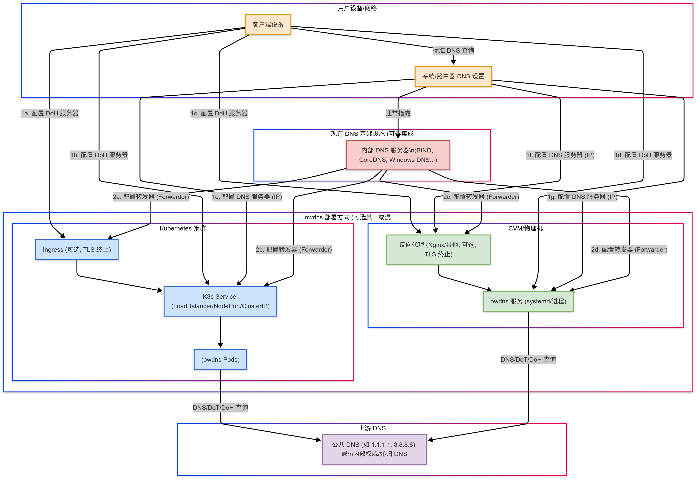

English | [中文](./README_CN.md)

<div align="center">
    <h1>Oxide WDNS</h1>
    <h4>🚀 A high-performance DNS gateway supporting DNS-over-HTTPS (DoH), written in Rust.</h4>
    
</div>

## Introduction

### 🤔 Why Secure DNS?

Traditional DNS queries are often transmitted in plain text over the network (usually via UDP port 53), leading to several significant issues:

1.  **Privacy Leakage:** Intermediate nodes on the network (like ISPs, public Wi-Fi providers) can easily snoop on your DNS query history, revealing which websites you visit.
2.  **DNS Hijacking/Poisoning:** Queries can be maliciously altered, redirecting you to incorrect or malicious websites (e.g., phishing sites).
3.  **Censorship & Blocking:** Certain network environments might block DNS resolution for specific domain names, thereby restricting internet access.

### 💡 How Does Secure DNS via HTTP (DoH) Address These Issues?

DNS-over-HTTPS (DoH) is a protocol (RFC 8484) that encapsulates DNS queries within encrypted HTTPS connections. This offers the following benefits:

-   **Encrypted Transmission:** DNS query content is encrypted via HTTPS, effectively preventing snooping and tampering by intermediate nodes.
-   **Traffic Obfuscation:** DoH queries appear similar to regular HTTPS traffic (both typically use port 443), making DNS blocking based on port or protocol characteristics more difficult.
-   **Enhanced Privacy & Security:** Combined with DNSSEC validation, DoH provides more comprehensive security for DNS resolution.

### ✨ Oxide WDNS: Your High-Performance DoH Gateway and Client

**Oxide WDNS** is a high-performance, secure, and reliable DoH solution built with Rust, comprising a server (`owdns`) and a client tool (`owdns-cli`).

Importantly, Oxide WDNS aims to be a **seamless extension** to traditional DNS, enhancing its security rather than completely replacing it; it establishes a **collaborative relationship** with existing DNS infrastructure. Furthermore, the `owdns` server is designed as a **stateless service**, meaning you can easily **scale it horizontally** to handle high concurrent loads.

-   **Server (`owdns`):** Acts as a DoH gateway, receiving DoH requests from clients, securely querying upstream DNS servers, and returning the results to the clients. It's ideal for deployment in local networks, edge nodes, or cloud environments, providing a unified, secure DNS resolution entry point for your devices or network.
-   **Client (`owdns-cli`):** A powerful command-line tool for sending queries to any RFC 8484 compliant DoH server, useful for testing, debugging, and validation.

Oxide WDNS directly addresses the privacy leakage, hijacking, and blocking issues faced by traditional DNS by providing encrypted DNS channels, supporting DNSSEC validation, and delivering high-performance processing capabilities.

### 🎯 Use Cases

The design of `owdns` makes it particularly suitable for environments requiring highly secure, reliable, and high-performance DNS resolution:

-   **Large-Scale Internet Services:** Provides scalable, secure, and highly available DNS resolution for massive user bases and internal systems. Protects user privacy through DoH encryption and prevents DNS cache poisoning and hijacking.
-   **Industrial Internet & Smart Manufacturing:** Ensures the confidentiality and integrity of DNS queries between devices, sensors, and platforms in Industrial Control Systems (ICS) and Industrial Internet of Things (IIoT) environments, preventing tampering or leakage of critical operational commands.
-   **Small and Medium-sized Cloud Service Providers:** Offers secure DoH resolution as a value-added service to tenants, enhancing platform security capabilities and customer trust. The high performance and ease of deployment of `owdns` make it an ideal choice.
-   **Internet of Things (IoT) Platforms:** Provides lightweight, secure DNS resolution services for a large number of connected IoT devices, preventing device hijacking through DNS spoofing attacks, especially suitable for resource-constrained edge computing scenarios.
-   **Healthcare Industry:** Protects the privacy of DNS queries when accessing sensitive systems like Electronic Health Records (EHR) and telemedicine platforms, meeting strict data security and compliance requirements (e.g., HIPAA).
-   **Robotics & Automation Systems:** Ensures that robot clusters and automated production line equipment can securely and accurately resolve target service addresses when communicating with control centers or cloud platforms, preventing operational interruptions or malicious control due to DNS errors.

### 📐 Deployment Architecture Diagram



## Key Features

**Server (`owdns`)**

-   🚀 **High Performance:** Built with Rust and Tokio for asynchronous processing and high memory efficiency.
-   🛡️ **Secure & Reliable:**
    -   Full **RFC 8484 (DoH)** protocol implementation.
    -   **DNSSEC** validation support for response authenticity and integrity.
    -   Built-in IP-based **rate limiting** and strict **input validation** to defend against abuse and attacks.
-   ⚙️ **Flexible Configuration:**
    -   Supports both **Wireformat (`application/dns-message`)** and **JSON (`application/dns-json`)** DoH formats.
    -   Supports **GET** and **POST** HTTP methods.
    -   Supports **HTTP/1.1** and **HTTP/2**.
    -   Configurable multiple **upstream DNS resolvers** supporting UDP, TCP, DoT (DNS-over-TLS), and DoH protocols.
    -   Flexible upstream selection strategies (e.g., round-robin, random).
-   ⚡ **Intelligent Caching:**
    -   Built-in high-performance **LRU cache** significantly reduces latency and upstream load.
    -   Supports **Negative Caching**.
    -   Configurable cache size and TTL.
-   📊 **Observability:**
    -   Integrated **Prometheus metrics** (`/metrics` endpoint) for easy monitoring of service status and performance.
    -   Provides **Kubernetes health check** endpoint (`/health`).
    -   Supports **structured logging** (Tracing).
-   ☁️ **Cloud-Native Friendly:** Easy to containerize and deploy.
-   🔌 **Graceful Shutdown:** Supports smooth service termination, ensuring in-flight requests are completed.

**Client (`owdns-cli`)**

-   ✅ **Protocol Compatibility:** Supports RFC 8484 Wireformat and Google/Cloudflare JSON formats.
-   🛡️ **DNSSEC Support:** Can request DNSSEC validation (sets the DO bit).
-   🔧 **Flexible Control:**
    -   Specify query **domain name** and **record type** (A, AAAA, MX, TXT, etc.).
    -   Manually select **GET** or **POST** methods (or auto-select).
    -   Choose **HTTP/1.1** or **HTTP/2**.
    -   Supports sending **raw DNS query payload** (Hex encoded).
-   🔎 **Response Analysis:**
    -   Clearly displays the parsed DNS response.
    -   Validate responses based on criteria like RCODE, IP address, etc.
-   🛠️ **Usability:**
    -   Clear command-line interface.
    -   Detailed output modes (`-v, -vv, -vvv`) for debugging.
    -   Supports skipping TLS certificate verification (`-k`) for testing local or self-signed certificate servers.

## Installation

You can install Oxide WDNS in the following ways:

1.  **Download Pre-compiled Binaries from GitHub Releases (Recommended):**
    Visit the project's [GitHub Releases](https://github.com/shengyanli1982/oxide-wdns/releases) page and download the latest version suitable for your operating system.

2.  **Compile from Source:**
    Ensure you have the [Rust toolchain](https://www.rust-lang.org/tools/install) installed.

    ```bash
    # Clone the repository
    git clone https://github.com/shengyanli1982/oxide-wdns.git
    cd oxide-wdns

    # Compile the server and client (Release mode, with optimizations)
    cargo build --release

    # Compiled binaries are located in ./target/release/
    # Server: owdns (or owdns.exe on Windows)
    # Client: owdns-cli (or owdns-cli.exe on Windows)
    ```

## Usage

### Server (`owdns`)

1.  **Configuration File (`config.yaml`):**
    The server is configured via a YAML file. You need to create a `config.yaml` file (or specify another path using `-c`). A basic configuration example is shown below (refer to `config.default.yaml` for structure):

    ```yaml
    # config.yaml

    # HTTP Server Configuration
    http_server:
        # Server listen address
        listen_addr: "127.0.0.1:3053" # Modify to your desired listen address and port
        # Server connection timeout (seconds)
        timeout: 120
        # Rate Limiting Configuration
        rate_limit:
            enabled: true # Enable rate limiting
            per_ip_rate: 100 # Max requests per second per IP
            per_ip_concurrent: 10 # Concurrent request limit per IP

    # DNS Resolver Configuration
    dns_resolver:
        # Upstream DNS Server Configuration
        upstream:
            enable_dnssec: true # Enable DNSSEC for upstream queries
            query_timeout: 30 # Upstream query timeout (seconds)
            # List of upstream resolvers (supports udp, tcp, dot, doh)
            resolvers:
                - address: "1.1.1.1:53"
                  protocol: "udp" # Cloudflare (UDP)
                - address: "8.8.8.8:53"
                  protocol: "udp" # Google (UDP)
                # - address: "cloudflare-dns.com@1.1.1.1:853"
                #   protocol: "dot"       # Cloudflare (DoT)
                # - address: "1.1.1.1:853"
                #   protocol: "tcp"       # Cloudflare (TCP, requires FQDN)
                # - address: "https://cloudflare-dns.com/dns-query"
                #   protocol: "doh"       # Cloudflare (DoH)

        # HTTP Client Configuration (mainly for DoH upstream)
        http_client:
            timeout: 120 # HTTP client timeout (seconds)
            pool:
                idle_timeout: 30 # Connection pool idle timeout (seconds)
                max_idle_connections: 10 # Max idle connections in the pool
            request:
                # Custom User-Agent can be set
                user_agent: "Oxide-WDNS Client"
                # HTTP headers to identify the real client IP (if owdns is behind a reverse proxy)
                ip_header_names:
                    - "X-Forwarded-For"
                    - "X-Real-IP"

        # Cache Configuration
        cache:
            enabled: true # Enable caching
            size: 10000 # Max number of cache entries
            ttl: # TTL configuration (seconds)
                min: 60 # Minimum TTL
                max: 86400 # Maximum TTL (1 day)
                negative: 300 # Negative cache TTL (5 minutes)
    ```

    _Please modify the configuration according to your needs, especially `http_server.listen_addr` and `dns_resolver.upstream.resolvers`. If you need to enable HTTPS, you might need to use a reverse proxy (like Nginx) to handle TLS termination._

2.  **Test Configuration File:**
    Before starting the service, you can use the `-t` flag to check if the configuration file is valid:

    ```bash
    ./owdns -t -c config.yaml
    ```

3.  **Start the Service:**

    **> Method 1: Direct Execution (Foreground)**

    You can start the `owdns` service directly from the command line. This is typically used for testing or temporary runs:

    ```bash
    # Use default config file config.yaml (must be in the current directory)
    ./owdns

    # Specify config file path
    ./owdns -c /path/to/your/config.yaml

    # Enable Debug level logging
    ./owdns -d -c config.yaml
    ```

    _Note: When started this way, the service runs in the foreground. Closing the terminal window will terminate the service._

    **> Method 2: Using systemd (Background Service, Recommended for Linux Servers)**

    If you want `owdns` to run as a background system service and start automatically on boot, using `systemd` is recommended. An example service unit file `examples/linux/systemd/owdns.service` is provided.

    **Configuration Steps:**

    1.  **Copy Executable:**
        Copy the compiled `owdns` binary to a system path, e.g., `/usr/local/bin/`:

        ```bash
        sudo cp ./target/release/owdns /usr/local/bin/
        ```

    2.  **Prepare Configuration File:**
        Place your `config.yaml` file where the `systemd` service file expects it. The default service file (`owdns.service`) uses `-c /etc/owdns/config.yaml`, so you need to:

        ```bash
        # Create configuration directory
        sudo mkdir -p /etc/owdns
        # Copy configuration file
        sudo cp config.yaml /etc/owdns/config.yaml
        ```

        _Important: The default `owdns.service` uses `DynamicUser=yes`, meaning `systemd` runs `owdns` as a temporary, low-privilege user (like `systemd-network`). Ensure this user **has read permissions for `/etc/owdns/config.yaml`**. You can adjust this with `sudo chown <user>:<group> /etc/owdns/config.yaml` and appropriate `chmod` permissions, or modify the user/group settings in `owdns.service`._

    3.  **Install systemd Service File:**
        Copy the example service file to the `systemd` system directory:

        ```bash
        sudo cp examples/linux/systemd/owdns.service /etc/systemd/system/
        ```

        _If you modified the paths for the executable or configuration file, remember to edit the `ExecStart` line in `/etc/systemd/system/owdns.service` accordingly._

    4.  **Reload systemd and Manage the Service:**

        ```bash
        # Reload systemd configuration
        sudo systemctl daemon-reload

        # Start the owdns service
        sudo systemctl start owdns

        # Enable the owdns service to start on boot
        sudo systemctl enable owdns

        # Check the service status
        sudo systemctl status owdns

        # View service logs in real-time
        sudo journalctl -u owdns -f

        # Stop the service
        # sudo systemctl stop owdns

        # Disable starting on boot
        # sudo systemctl disable owdns
        ```

    **> Method 3: Deploying with Kubernetes (Recommended for Containerized Environments)**

    If you are running services in a Kubernetes environment, example deployment manifests are provided in the `examples/kubernetes/` directory. These typically include:

    -   `configmap.yaml`: Manages the `owdns` configuration file (`config.yaml`).
    -   `deployment.yaml`: Defines the `owdns` application deployment, including replica count, container image, ports, etc.
    -   `service.yaml`: Creates a Kubernetes Service to expose the `owdns` service, making it accessible within the cluster or externally.

    **Deployment Steps:**

    1.  **Prepare Environment:** Ensure you have a running Kubernetes cluster and the `kubectl` command-line tool is configured and connected to it.

    2.  **Customize Configuration:**

        -   **Edit `configmap.yaml`:** Modify the `config.yaml` content within the ConfigMap according to your needs, especially `http_server.listen_addr` (should usually listen on `0.0.0.0` or a specific Pod IP, set port as needed), `dns_resolver.upstream.resolvers`, etc.
        -   **Edit `deployment.yaml` (Optional):** You might need to change the container image path (`spec.template.spec.containers[0].image`) if you push the image to your own container registry. You can also adjust the replica count (`spec.replicas`).
        -   **Edit `service.yaml` (Optional):** Adjust the Service type (e.g., `ClusterIP`, `NodePort`, `LoadBalancer`) and port settings based on your access requirements.

    3.  **Apply Manifests:**
        Use `kubectl` to apply all YAML files in the `examples/kubernetes/` directory:

        ```bash
        kubectl apply -f examples/kubernetes/
        # Or apply individually
        # kubectl apply -f examples/kubernetes/configmap.yaml
        # kubectl apply -f examples/kubernetes/deployment.yaml
        # kubectl apply -f examples/kubernetes/service.yaml
        ```

    4.  **Verify Deployment:**
        Check if the Pods are running successfully and the Service has been created:

        ```bash
        # Check Pod status (should show Running)
        kubectl get pods -l app=owdns # Assuming Deployment/Pod has 'app=owdns' label

        # Check Service info (get access IP and port)
        kubectl get svc owdns-service # Assuming Service name is 'owdns-service'

        # View Pod logs
        kubectl logs -l app=owdns -f
        ```

    5.  **Access the Service:**
        Depending on your Service configuration (type and port), you can access the deployed `owdns` DoH service via ClusterIP (internal), NodePort, or LoadBalancer IP (external). For example, if the Service is of type LoadBalancer and exposes port 80, you can use `http://<LoadBalancer-IP>/dns-query` as the DoH endpoint.

4.  **Get Help / Command-Line Arguments:**
    View the complete list of command-line arguments using `-h` or `--help`:

    ```bash
    $ ./owdns -h
    High-performance Secure DNS via HTTP (DoH) Gateway

    Key Features:
    - Full RFC 8484 HTTP-based DNS transport compliance
    - Google/Cloudflare JSON format compatibility
    - Advanced DNSSEC validation
    - Multi-protocol upstream support (UDP, TCP, DoT, DoH)
    - Performance-optimized LRU caching
    - Prometheus metrics integration
    - Native Kubernetes health probes
    - Enterprise-grade security with rate limiting and input validation

    Author: shengyanli1982
    Email: shengyanlee36@gmail.com
    GitHub: https://github.com/shengyanli1982

    Usage: owdns [OPTIONS]

    Options:
      -c, --config <CONFIG>  Server configuration file path (YAML format) [default: config.yaml]
      -t, --test             Test configuration file for validity and exit
      -d, --debug            Enable debug level logging for detailed output
      -h, --help             Print help
      -V, --version          Print version
    ```

### Client (`owdns-cli`)

The client is used to send queries to a DoH server.

1.  **Basic Query:**
    Query the A record for a domain from a specified DoH server URL.

    ```bash
    # Query A record for example.com (using Cloudflare DoH)
    ./owdns-cli https://cloudflare-dns.com/dns-query example.com

    # Query A record for example.com (using local owdns service, assuming listen on port 8080)
    # Note: Use http:// if the local service is not configured with TLS
    ./owdns-cli http://localhost:8080/dns-query example.com
    # If local service uses TLS with a self-signed cert, you might need -k
    ./owdns-cli -k https://localhost:8080/dns-query example.com
    ```

2.  **Specify Record Type (`-r` or `--record`):**

    ```bash
    # Query MX record for google.com
    ./owdns-cli https://dns.google/dns-query google.com -r MX
    ```

3.  **Select DoH Format (`--format`):**

    ```bash
    # Query using JSON format
    ./owdns-cli https://cloudflare-dns.com/dns-query example.com --format json
    ```

4.  **Enable DNSSEC (`--dnssec`):**
    Request the server to perform DNSSEC validation (requires server support).

    ```bash
    ./owdns-cli https://cloudflare-dns.com/dns-query sigfail.verteiltesysteme.net --dnssec
    ```

5.  **Force POST Method (`-X POST`):**

    ```bash
    ./owdns-cli https://cloudflare-dns.com/dns-query example.com -X POST
    ```

6.  **Verbose Output (`-v`, `-vv`, `-vvv`):**
    Increase the number of `-v` flags for more detailed debug information (including HTTP headers and request/response details).

    ```bash
    ./owdns-cli https://cloudflare-dns.com/dns-query example.com -v
    ```

7.  **Validate Response (`--validate`):**
    Check if the response meets specific conditions.

    ```bash
    # Validate if RCODE is NOERROR and response contains IP 1.1.1.1
    ./owdns-cli https://cloudflare-dns.com/dns-query one.one.one.one --validate 'rcode=NOERROR,has-ip=1.1.1.1'
    ```

8.  **Get Help / Command-Line Arguments:**
    View the complete list of command-line arguments using `-h` or `--help`:

    ```bash
    $ ./owdns-cli -h
    A command-line client for Secure DNS via HTTP (DoH).

    Features:
    - RFC 8484 wireformat and Google/Cloudflare JSON support
    - DNSSEC validation requests
    - GET/POST method selection (automatic or manual)
    - HTTP/1.1 and HTTP/2 support
    - Response analysis and validation

    Author: shengyanli1982
    Email: shengyanlee36@gmail.com
    GitHub: https://github.com/shengyanli1982

    Usage: owdns-cli [OPTIONS] <SERVER_URL> <DOMAIN>

    Arguments:
      <SERVER_URL>  Full URL of the DoH server endpoint (e.g., https://cloudflare-dns.com/dns-query)
      <DOMAIN>      Domain name to query via the DoH server (e.g., example.com)

    Options:
      -r, --record <RECORD_TYPE>  DNS record type to query (e.g., A, AAAA, MX, TXT) [default: A]
          --format <FORMAT>       DoH request format: 'wire' (application/dns-message) or 'json' (application/dns-json) [default: wire] [possible values: wire, json]
      -X, --method <METHOD>       Force the HTTP method (GET or POST). Auto-selected if unspecified [possible values: get, post]
          --http <HTTP_VERSION>   Preferred HTTP version for communication (1.1 or 2) [possible values: http1, http2]
          --dnssec                Enable DNSSEC validation by setting the DNSSEC OK (DO) bit
          --payload <PAYLOAD>     Send a raw, hex-encoded DNS query payload (overrides domain/type)
          --validate <VALIDATE>   Validate the response against comma-separated conditions (e.g., 'rcode=NOERROR', 'has-ip=1.2.3.4')
      -k, --insecure              Skip TLS certificate verification (use with caution)
      -v, --verbose...            Increase output verbosity (-v, -vv, -vvv)
          --no-color              Disable colored output in the terminal
      -h, --help                  Print help
      -V, --version               Print version
    ```

### Example Client Scripts

You can find example scripts for calling the DoH API using different languages (like Python, Shell, Go, etc.) in the `examples/client/` directory.

## Contributing

Issues and Pull Requests are welcome! Please ensure you follow the project's code specifications.

## License

This project is licensed under the [MIT](./LICENSE) License.

```bash
cargo test --test doh_api_tests
cargo test --test rate_limit_tests
```

google dns-over-https

```bash
$ curl -s -H 'accept: application/dns+json' \
'https://dns.google.com/resolve?name=www.potaroo.net&type=A' | jq

{
    "Status": 0,
    "TC": false,
    "RD": true,
    "RA": true,
    "AD": true,
    "CD": false,
    "Question": [
        {
            "name": "www.potaroo.net.",
            "type": 1
        }
    ],
    "Answer": [
        {
            "name": "www.potaroo.net.",
            "type": 1,
            "TTL": 6399,
            "data": "203.133.248.2"
        }
    ],
    "Comment": "Response from 203.133.248.2."
}
```

rfc8484 dns-over-https

```bash
$ curl -s -H 'accept: application/dns-message' \
'https://cloudflare-dns.com/dns-query?name=www.potaroo.net&type=A' | hexdump -C
```

cargo test -p oxide-wdns server::config_tests
cargo test -p oxide-wdns server::server_integration_tests
