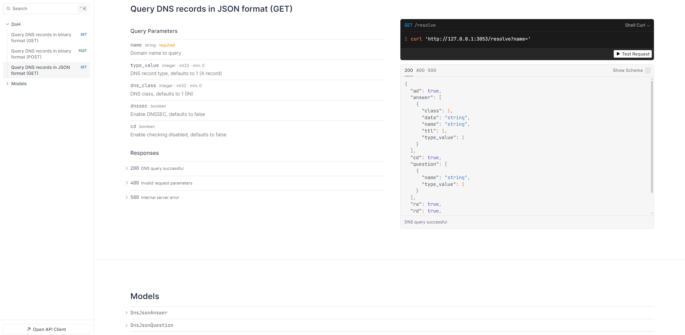

[English](./README.md) | 中文

<div align="center">
    <h1>Oxide WDNS</h1>
    <h4>🚀 一款基于 Rust 构建的高性能 DNS-over-HTTPS (DoH) 网关。</h4>
    
</div>

<p align="center">
  <a href="#简介">简介</a>
  |
  <a href="#主要特性">主要特性</a>
  |
  <a href="#缓存持久化性能考量">缓存持久化性能考量</a>
  |
  <a href="#prometheus-指标">Prometheus 指标</a>
  |
  <a href="#api-端点">API 端点</a>
  |
  <a href="#安装">安装</a>
  |
  <a href="#使用">使用</a>
</p>

[](https://github.com/shengyanli1982/oxide-wdns/actions)

## 简介

### 🤔 为什么需要安全 DNS？

传统的 DNS 查询通常通过网络以明文形式传输（通常通过 UDP 53 端口），这会导致几个重要问题：

1.  **隐私泄露：** 网络上的中间节点（如 ISP、公共 Wi-Fi 提供商）可以轻易窥探您的 DNS 查询历史，从而得知您访问了哪些网站。
2.  **DNS 劫持/投毒：** 查询可能被恶意篡改，将您重定向到错误或恶意的网站（例如，钓鱼网站）。
3.  **审查与封锁：** 某些网络环境可能会阻止特定域名的 DNS 解析，从而限制互联网访问。

### 💡 基于 HTTP 的安全 DNS (DoH) 如何解决这些问题？

DNS-over-HTTPS (DoH) 是一种协议 (RFC 8484)，它将 DNS 查询封装在加密的 HTTPS 连接中。这带来了以下好处：

-   **加密传输：** DNS 查询内容通过 HTTPS 加密，有效防止中间节点的窥探和篡改。
-   **流量混淆：** DoH 查询看起来与常规 HTTPS 流量类似（两者通常都使用 443 端口），使得基于端口或协议特征的 DNS 封锁更加困难。
-   **增强隐私与安全：** 结合 DNSSEC 验证，DoH 为 DNS 解析提供了更全面的安全保障。

### ✨ Oxide WDNS: 您的高性能 DoH 网关和客户端

**Oxide WDNS** 是一个高性能、安全且可靠的 DoH 解决方案，使用 Rust 构建，包含一个服务器 (`owdns`) 和一个客户端工具 (`owdns-cli`)。

重要的是，Oxide WDNS 旨在成为传统 DNS 的**无缝扩展**，增强其安全性而非完全取代；它与现有的 DNS 基础设施建立了**协作关系**。此外，`owdns` 服务器被设计为一个**无状态服务**，这意味着您可以轻松地对其进行**水平扩展**以处理高并发负载。

-   **服务器 (`owdns`)：** 充当 DoH 网关，接收来自客户端的 DoH 请求，安全地查询上游 DNS 服务器，并将结果返回给客户端。它非常适合部署在本地网络、边缘节点或云环境中，为您的设备或网络提供统一、安全的 DNS 解析入口。
-   **客户端 (`owdns-cli`)：** 一个强大的命令行工具，用于向任何符合 RFC 8484 标准的 DoH 服务器发送查询，可用于测试、调试和验证。

Oxide WDNS 通过提供加密的 DNS 通道、支持 DNSSEC 验证以及提供高性能处理能力，直接解决了传统 DNS 面临的隐私泄露、劫持和封锁问题。

### 🎯 应用场景

`owdns` 的设计使其特别适用于需要高度安全、可靠和高性能 DNS 解析的环境：

-   **大规模互联网服务：** 为海量用户群和内部系统提供可扩展、安全且高度可用的 DNS 解析。通过 DoH 加密保护用户隐私，并防止 DNS 缓存投毒和劫持。
-   **工业互联网与智能制造：** 在工业控制系统 (ICS) 和工业物联网 (IIoT) 环境中，确保设备、传感器和平台之间 DNS 查询的机密性和完整性，防止关键操作指令被篡改或泄露。
-   **中小型云服务提供商：** 为租户提供安全的 DoH 解析作为增值服务，增强平台安全能力和客户信任。`owdns` 的高性能和易部署性使其成为理想选择。
-   **物联网 (IoT) 平台：** 为大量连接的物联网设备提供轻量级、安全的 DNS 解析服务，防止通过 DNS 欺骗攻击劫持设备，特别适用于资源受限的边缘计算场景。
-   **医疗保健行业：** 在访问电子健康记录 (EHR) 和远程医疗平台等敏感系统时，保护 DNS 查询的隐私，满足严格的数据安全和合规性要求（例如 HIPAA）。
-   **机器人与自动化系统：** 确保机器人集群和自动化生产线设备在与控制中心或云平台通信时，能够安全、准确地解析目标服务地址，防止因 DNS 错误导致操作中断或恶意控制。

### 📐 部署架构图


## 主要特性

**服务器 (`owdns`)**

-   🚀 **高性能：** 基于 Rust 和 Tokio 构建，实现异步处理和高内存效率。
-   🛡️ **安全可靠：**
    -   完整实现 **RFC 8484 (DoH)** 协议。
    -   支持 **DNSSEC** 验证，确保响应的真实性和完整性。
    -   内置基于 IP 的**速率限制**和严格的**输入验证**，以防御滥用和攻击。
-   ⚙️ **灵活配置：**
    -   同时支持 **Wireformat (`application/dns-message`)** 和 **JSON (`application/dns-json`)** 两种 DoH 格式。
    -   支持 **GET** 和 **POST** HTTP 方法。
    -   支持 **HTTP/1.1** 和 **HTTP/2**。
    -   可配置多个**上游 DNS 解析器**，支持 UDP、TCP、DoT (DNS-over-TLS) 和 DoH 协议。
    -   灵活的上游选择策略（例如，轮询、随机）。
-   🔀 **强大的 DNS 路由/分流：**
    -   定义多个**上游 DNS 服务器组** (`upstream_groups`)。每个组都可以独立配置其自己的解析器、DNSSEC 设置（例如 `enable_dnssec`）、超时和其他参数。
        -   如果一个组没有显式定义特定设置（如 `enable_dnssec`），它将继承 `dns_resolver.upstream` 中相应的全局默认值。
        -   如果一个组*确实*显式定义了某个设置，则该值*仅适用于该特定组*，覆盖其查询的全局默认值。这种覆盖是局部的，不会影响全局默认值本身，也不会影响任何其他 `upstream_group` 的配置（包括被指定为 `default_upstream_group` 的组，除非此组*是*默认组）。
    -   基于灵活的**规则**将 DNS 查询路由到特定组。
    -   支持的规则类型：**精确**域名匹配、**正则表达式**模式匹配、**通配符**匹配（例如 `*.example.com`）、从本地**文件**加载的规则以及从远程 **URL** 获取的规则。
    -   内置特殊的 `__blackhole__` 组，用于**阻止/丢弃**特定的 DNS 查询（例如，用于广告拦截）。
    -   为不匹配的查询配置**默认上游组**，或回退到全局上游配置。
    -   支持从远程 URL **自动定期重新加载**规则，并为每个 URL 规则提供**独立可配置的更新间隔**和高效的基于内容的更新检测。
-   ⚡ **智能缓存：**
    -   内置高性能 **LRU 缓存**，显著减少延迟和上游负载。
    -   支持**否定缓存**（包括 `__blackhole__` 响应）。
    -   可配置缓存大小和 TTL。
    -   **持久化缓存：**
        -   允许服务在关闭时将内存中的 DNS 缓存保存到磁盘，并在下次启动时重新加载。
        -   显著减少服务重启后的"冷启动"时间，并快速恢复缓存命中率。
        -   减少重启后初始启动阶段对上游 DNS 服务器的压力。
        -   支持配置持久化路径、启动时是否加载、要保存的最大条目数以及是否跳过过期条目。
        -   支持定期自动将缓存保存到磁盘。
-   🔒 **EDNS 客户端子网 (ECS) 处理：**
    -   灵活控制如何处理和转发客户端 ECS 信息 (RFC 7871)，在用户隐私与 CDN 等地理敏感服务的性能之间取得平衡。
    -   支持三种策略：
        -   `strip` (默认): 在向上游发送查询之前删除所有 ECS 信息，最大限度地保护隐私。
        -   `forward`: 将客户端的原始 ECS 信息直接转发给上游。
        -   `anonymize`: 转发匿名的 ECS 信息（例如，保留 IPv4 的 /24 网络）。
    -   可以全局配置，也可以为特定的上游 DNS 服务器组覆盖。
    -   **ECS 感知缓存**：缓存会考虑 ECS 范围，以确保更准确的地理位置响应。
-   📊 **可观测性：**
    -   集成 **Prometheus 指标** (`/metrics` 端点)，便于监控服务状态和性能。
    -   提供 **Kubernetes 健康检查**端点 (`/health`)。
    -   支持**结构化日志** (Tracing)。
-   ☁️ **云原生友好：** 易于容器化和部署。
-   🔌 **优雅关闭：** 支持平滑的服务终止，确保正在进行的请求得以完成。

**客户端 (`owdns-cli`)**

-   ✅ **协议兼容性：** 支持 RFC 8484 Wireformat 和 Google/Cloudflare JSON 格式。
-   🛡️ **DNSSEC 支持：** 可以请求 DNSSEC 验证（设置 DO 位）。
-   🔧 **灵活控制：**
    -   指定查询**域名**和**记录类型** (A, AAAA, MX, TXT 等)。
    -   手动选择 **GET** 或 **POST** 方法（或自动选择）。
    -   选择 **HTTP/1.1** 或 **HTTP/2**。
    -   支持发送**原始 DNS 查询负载** (十六进制编码)。
-   🔎 **响应分析：**
    -   清晰显示已解析的 DNS 响应。
    -   基于 RCODE、IP 地址等标准验证响应。
-   🛠️ **易用性：**
    -   清晰的命令行界面。
    -   详细的输出模式 (`-v, -vv, -vvv`) 用于调试。
    -   支持跳过 TLS 证书验证 (`-k`)，用于测试本地或自签名证书服务器。

## 缓存持久化性能考量

`DnsCache` 持久化机制利用 `spawn_blocking`（用于保存）和 `block_in_place`（用于加载）来实现异步核心 I/O 操作，防止直接阻塞主异步运行时。然而，在具有大缓存和高并发的场景中，应注意以下几点：

-   **保存操作：** 数据准备步骤，例如缓存迭代和排序，在保存任务的异步上下文中同步执行。在高负载下，这可能成为 CPU 瓶颈并导致瞬时内存峰值。
-   **加载操作：** 反序列化大量缓存数据可能会延长服务启动时间。在高负载条件下，这些因素可能会间接影响整体性能和响应能力。

## Prometheus 指标

Oxide WDNS 提供全面的 Prometheus 指标，用于监控服务的性能、健康状况和运行状态。这些指标通过 `/metrics` 端点公开，可以被 Prometheus 或其他兼容的监控系统抓取。

### HTTP 性能指标

-   **owdns_http_requests_total** (计数器) - HTTP 请求总数，按方法、路径、状态码、格式 (wire/json) 和 http_version (1.1/2) 标记。
-   **owdns_http_request_duration_seconds** (直方图) - 请求处理延迟，按方法、路径和格式标记。
-   **owdns_http_request_bytes** (直方图) -传入 HTTP 请求的大小。
-   **owdns_http_response_bytes** (直方图) - 传出 HTTP 响应的大小。
-   **owdns_rate_limit_rejected_total** (计数器) - 因速率限制而被拒绝的请求数，按客户端 IP 标记。

### 缓存效率指标

-   **owdns_cache_entries** (仪表盘) - 缓存中的当前条目数。
-   **owdns_cache_capacity** (仪表盘) - 缓存的最大容量。
-   **owdns_cache_operations_total** (计数器) - 总缓存操作数，按操作类型（命中/未命中/插入/逐出/过期）标记。
-   **owdns_cache_ttl_seconds** (直方图) - 缓存条目 TTL 的分布。

### DNS 查询指标

-   **owdns_dns_queries_total** (计数器) - 处理的 DNS 查询总数，按查询类型和状态标记。
-   **owdns_dns_responses_total** (计数器) - DNS 响应总数，按响应码 (RCODE: NOERROR, NXDOMAIN, SERVFAIL 等) 标记。
-   **owdns_dns_query_type_total** (计数器) - 按 DNS 记录类型 (A, AAAA, MX 等) 统计的查询数。
-   **owdns_dns_query_duration_seconds** (直方图) - DNS 查询处理时间。

### 上游解析器指标

-   **owdns_upstream_requests_total** (计数器) - 发送到上游解析器的请求总数，按解析器地址、协议和 upstream_group 标记。
-   **owdns_upstream_failures_total** (计数器) - 上游解析器故障总数，按故障类型 (error/timeout)、解析器地址和 upstream_group 标记。
-   **owdns_upstream_duration_seconds** (直方图) - 上游查询延迟，按解析器地址、协议和 upstream_group 标记。

### DNS 路由指标

-   **owdns_route_results_total** (计数器) - 总路由结果数，按结果类型 (rule_match/blackhole/default) 标记。
-   **owdns_route_rules** (仪表盘) - 活动路由规则的数量，按规则类型 (exact, regex, wildcard, file, url) 标记。
-   **owdns_url_rule_update_duration_seconds** (直方图) - URL 规则更新操作延迟，按操作阶段和结果状态 (fetch/parse/update, success/failure) 标记。

### DNSSEC 验证指标

-   **owdns_dnssec_validations_total** (计数器) - 执行的 DNSSEC 验证次数，按结果状态 (success/failure) 标记。

### ECS 处理指标

-   **owdns_ecs_processed_total** (计数器) - 处理的 ECS (EDNS 客户端子网) 操作总数，按策略 (strip/forward/anonymize) 标记。
-   **owdns_ecs_cache_matches_total** (计数器) - ECS 感知缓存匹配数。

### 缓存持久化指标

-   **owdns_cache_persist_operations_total** (计数器) - 总缓存持久化操作数，按操作类型 (save/load) 标记。
-   **owdns_cache_persist_duration_seconds** (直方图) - 缓存持久化操作延迟，按操作类型 (save/load) 标记。

这些指标可以对 Oxide WDNS 的性能和行为进行详细监控和分析，从而更容易识别问题、优化配置并确保服务满足您的性能要求。

## API 端点

Oxide WDNS 提供以下 HTTP API 端点，用于 DNS 解析和服务监控：

### RFC 8484 DoH 端点

-   **GET /dns-query**

    -   _内容类型_: application/dns-message
    -   _参数_: `dns` (Base64url 编码的 DNS 请求)
    -   _描述_: 使用 RFC 8484 wireformat 查询 DNS 记录，DNS 请求以 base64url 编码
    -   _示例_: `GET /dns-query?dns=AAABAAABAAAAAAAAA3d3dwdleGFtcGxlA2NvbQAAAQAB`

-   **POST /dns-query**
    -   _内容类型_: application/dns-message
    -   _请求体_: 二进制 DNS 查询报文
    -   _描述_: 通过在请求体中提交原始 DNS 报文来查询 DNS 记录
    -   _注意_: 对于大型查询更高效，因为它避免了 base64 编码开销

### Google/Cloudflare JSON API 兼容端点

-   **GET /resolve**
    -   _内容类型_: application/dns-json
    -   _参数_:
        -   `name` (必需): 要查询的域名 (例如 example.com)
        -   `type` (可选): DNS 记录类型，可以是数字或字符串 (默认为 1，代表 A 记录)
        -   `dnssec` (可选): 启用 DNSSEC 验证 (true/false)
        -   `cd` (可选): 禁用 DNSSEC 验证检查 (true/false)
        -   `do` (可选): 设置 DNSSEC OK 位 (true/false)
    -   _描述_: 查询 DNS 记录，结果以 JSON 格式返回
    -   _示例_: `GET /resolve?name=example.com&type=A&dnssec=true`

### 监控和健康检查端点

-   **GET /health**

    -   _描述_: 用于监控服务和 Kubernetes 探针的健康检查端点
    -   _返回_: 服务健康时返回 200 OK

-   **GET /metrics**
    -   _描述_: Prometheus 指标端点，公开性能和操作统计信息
    -   _内容类型_: text/plain

### 调试模式端点

当服务器以调试标志 `-d` 运行时，可以使用其他开发人员工具：

-   **GET /scalar**
    -   _描述_: 交互式 API 文档和测试用户界面
    -   _注意_: 仅在服务器以调试模式启动时可用



这些端点遵循标准的 HTTP 状态码：

-   200: 查询成功
-   400: 无效的请求参数
-   415: 不支持的媒体类型
-   429:超出速率限制
-   500: 处理过程中的服务器错误

## 安装

您可以通过以下方式安装 Oxide WDNS：

1.  **从 GitHub Releases 下载预编译的二进制文件 (推荐):**
    访问项目的 [GitHub Releases](https://github.com/shengyanli1982/oxide-wdns/releases) 页面，下载适用于您操作系统的最新版本。

2.  **从源代码编译:**
    确保您已安装 [Rust 工具链](https://www.rust-lang.org/tools/install)。

    ```bash
    # 克隆仓库
    git clone https://github.com/shengyanli1982/oxide-wdns.git
    cd oxide-wdns

    # 编译服务器和客户端 (Release 模式，带优化)
    cargo build --release

    # 编译后的二进制文件位于 ./target/release/
    # 服务器: owdns (Windows 上为 owdns.exe)
    # 客户端: owdns-cli (Windows 上为 owdns-cli.exe)
    ```

3.  **使用 Docker (推荐用于容器化环境):**
    在容器化环境中运行 Oxide WDNS 最简单的方法是使用 Docker。

    ```bash
    # 从 Docker Hub 拉取最新镜像
    # 或 docker pull ghcr.io/shengyanli1982/oxide-wdns-arm64:latest
    docker pull ghcr.io/shengyanli1982/oxide-wdns-x64:latest

    # 运行容器
    # 将容器的 3053 端口映射到主机的 3053 端口
    # 将本地配置文件挂载到容器中
    docker run -d \
      --name owdns \
      -p 3053:3053 \
      -v $(pwd)/config.yaml:/app/config.yaml \
      ghcr.io/shengyanli1982/oxide-wdns-x64:latest
    # 或 ghcr.io/shengyanli1982/oxide-wdns-arm64:latest

    # 在容器中使用客户端 (owdns-cli)：
    docker exec owdns /app/owdns-cli [选项] [参数]

    # 例如，使用 DoH 服务器查询 example.com：
    docker exec owdns /app/owdns-cli https://cloudflare-dns.com/dns-query example.com
    ```

## 使用

### 服务器 (`owdns`)

1.  **配置文件 (`config.yaml`):**
    服务器通过 YAML 文件进行配置。您需要创建一个 `config.yaml` 文件（或使用 `-c` 指定另一个路径）。有关完整的结构和默认值，请参阅 `config.default.yaml`。以下是一个展示包括 DNS 路由在内的关键功能的示例：

    ```yaml
    # config.yaml - 带路由的示例

    # HTTP 服务器配置
    http_server:
        listen_addr: "127.0.0.1:3053"
        timeout: 120
        rate_limit:
            enabled: true
            per_ip_rate: 100
            per_ip_concurrent: 10

    # DNS 解析器配置
    dns_resolver:
        # HTTP 客户端配置 (用于 DoH 上游和获取 URL 规则)
        http_client:
            timeout: 120
            pool:
                idle_timeout: 30
                max_idle_connections: 10
            request:
                user_agent: "Oxide-WDNS Client"
                ip_header_names: ["X-Forwarded-For", "X-Real-IP", "CF-Connecting-IP"]

        # 缓存配置
        cache:
            enabled: true
            size: 10000
            ttl:
                min: 60
                max: 86400
                negative: 300 # 否定响应 (NXDOMAIN) 的 TTL，包括 __blackhole__
            # --- 持久化缓存配置 ---
            persistence:
                # 启用缓存持久化。
                enabled: true
                # 缓存文件路径。
                path: "./cache.dat"
                # 启动时自动从磁盘加载缓存。
                load_on_startup: true
                # (可选) 保存到磁盘的最大缓存条目数。
                max_items_to_save: 0
                # 从磁盘加载时跳过已过期的条目。
                skip_expired_on_load: true
                # 关闭期间保存缓存的超时时间 (秒)。
                shutdown_save_timeout_secs: 30
                # --- 定期保存配置 ---
                periodic:
                    # 启用定期保存缓存。
                    enabled: true
                    # 定期保存的间隔时间 (秒)。
                    interval_secs: 3600

        # --- 全局/默认上游 DNS 配置 ---
        # 本节定义了各种参数的全局默认值，例如 'enable_dnssec' 和 'query_timeout'。
        # 如果特定组内未显式覆盖，则上游组将继承这些全局默认值。
        # 至关重要的是，这些全局默认值本身不会被任何特定于组的覆盖所修改。
        upstream:
            enable_dnssec: true # DNSSEC 的全局默认值。除非组自行定义，否则由组继承。
            query_timeout: 30 # 全局默认查询超时时间 (秒)。
            resolvers:
                - address: "1.1.1.1:53"
                  protocol: "udp"
                - address: "8.8.8.8:53"
                  protocol: "udp"
                # DoT/DoH 上游示例:
                # - address: "cloudflare-dns.com@1.1.1.1:853"
                #   protocol: "dot"
                # - address: "https://cloudflare-dns.com/dns-query"
                #   protocol: "doh"

        # --- EDNS 客户端子网 (ECS) 处理策略配置 ---
        ecs_policy:
            # 启用 ECS 处理策略。
            # 默认值: false (但建议在需要启用功能时设置为 true)
            enabled: true
            # 全局 ECS 处理策略。
            # 可能的值: "strip", "forward", "anonymize"
            strategy: "strip"
            # 匿名化设置，当策略为 "anonymize" 时有效。
            anonymization:
                # 对于 IPv4 地址，要保留的网络前缀长度 (1-32)。默认值: 24
                ipv4_prefix_length: 24
                # 对于 IPv6 地址，要保留的网络前缀长度 (1-128)。默认值: 48
                ipv6_prefix_length: 48

    # --- DNS 路由配置 ---
    routing:
        # 启用 DNS 路由功能
        enabled: true

        # 定义上游 DNS 服务器组
        # 每个组独立配置其参数。特定于组的设置 (例如 'enable_dnssec: false')
        # 仅覆盖该组的全局默认值。它不会改变全局默认值本身，也不会影响其他组。
        # 如果组内未指定某个设置，则它将从 'dns_resolver.upstream' 继承。
        upstream_groups:
            - name: "clean_dns" # 示例：一个纯净的 DNS 组
                # 该组未指定 'enable_dnssec' 或 'query_timeout'。
                # 因此，它将从 'dns_resolver.upstream' 继承这些值 (例如 enable_dnssec: true)。
                resolvers:
                    - address: "https://dns.quad9.net/dns-query"
                      protocol: "doh"
                    - address: "9.9.9.9:53"
                      protocol: "udp"
                # 可选：为此组覆盖全局 ECS 策略
                ecs_policy:
                    enabled: true
                    strategy: "forward" # 该组将转发原始 ECS

            - name: "domestic_dns" # 示例：针对国内域名优化的 DNS 组
                # 该组显式覆盖了 'enable_dnssec' 和 'query_timeout'。
                # 这些覆盖仅适用于 'domestic_dns' 组。
                # 它们不会更改 'dns_resolver.upstream' 中的全局默认值，
                # 也不会影响 'clean_dns' 或任何其他组如何确定其 DNSSEC 行为。
                enable_dnssec: false # 仅为 'domestic_dns' 覆盖。
                query_timeout: 15   # 仅为 'domestic_dns' 覆盖。
                resolvers:
                    - address: "https://dns.alidns.com/dns-query"
                      protocol: "doh"
                    - address: "223.5.5.5:53"
                      protocol: "udp"
                # 可选：为此组覆盖全局 ECS 策略并使用匿名化
                ecs_policy:
                    enabled: true
                    strategy: "anonymize"
                    anonymization:
                        ipv4_prefix_length: 24
                        ipv6_prefix_length: 56 # 为此组指定不同的 IPv6 匿名化级别

            - name: "adblock_dns" # 示例：已知用于广告拦截的 DNS 组
                resolvers:
                    - address: "https://dns.adguard-dns.com/dns-query"
                      protocol: "doh"

        # 定义路由规则 (按顺序处理，第一个匹配的规则生效)
        rules:
            # 规则 1: 使用特殊的 __blackhole__ 组阻止特定的广告域名
            - match:
                type: exact
                values: ["ads.example.com", "analytics.example.org"]
                upstream_group: "__blackhole__" # 特殊组：丢弃查询，返回 NXDOMAIN

            # 规则 2: 将特定的国内域名路由到 domestic_dns 组
            - match:
                type: exact
                values: ["bilibili.com", "qq.com", "taobao.com", "jd.com"]
                upstream_group: "domestic_dns"

            # 规则 3: 将匹配正则表达式模式的域名路由到 clean_dns 组
            - match:
                type: regex
                values:
                    - "^(.*\.)?(google|youtube|gstatic)\.com$"
                    - "^(.*\.)?github\.com$"
                upstream_group: "clean_dns"

            # 规则 4: 将匹配通配符的域名路由到 clean_dns 组
            - match:
                type: wildcard
                values: ["*.googleapis.com", "*.ggpht.com"]
                upstream_group: "clean_dns"

            # 规则 5: 从本地文件加载国内域名，并将其路由到 domestic_dns 组
            # 有关文件格式详细信息，请参阅下面的"域名列表文件格式"部分。
            - match:
                type: file
                path: "/etc/oxide-wdns/china_domains.txt"
                upstream_group: "domestic_dns"

            # 规则 6: 从远程 URL 加载广告域名，并使用 __blackhole__ 阻止它们
            # 来自 URL 的规则会定期获取。请参阅下面的"域名列表文件格式"。
            - match:
                type: url
                url: "https://raw.githubusercontent.com/privacy-protection-tools/anti-AD/master/anti-ad-domains.txt"
                upstream_group: "__blackhole__"
                # --- URL 规则定期更新配置 ---
                periodic:
                    # 启用此 URL 规则的定期更新。
                    # 启用后，系统将定期获取和更新规则内容
                    # 如果未指定，则默认为 false
                    enabled: true
                    # 定期获取的更新间隔 (秒) (例如 3600 = 1 小时)。
                    # 每个 URL 规则都可以有自己独立的更新间隔。
                    # 仅当 periodic.enabled 为 true 时有效。
                    interval_secs: 3600
                    # 系统使用 xxHash (xxh64) 实现基于内容的更新检测，
                    # 以避免在远程内容未更改时不必要的解析和更新，
                    # 最大限度地减少资源消耗和写锁定争用。

        # 可选：未匹配任何规则的查询的默认上游组。
        # 如果此处指定了 'upstream_groups' 中的有效组名 (例如 "clean_dns")：
        #   - 未匹配的查询由此指定的默认组处理。
        #   - 这些查询的 DNSSEC 行为 (和其他参数) 完全由此指定默认组的配置决定
        #     (即其自身的显式设置或在没有显式设置时继承的全局默认值)。
        #   - 其他非默认组的 'enable_dnssec' 设置对此默认行为没有影响。
        # 如果为 null、省略或给定了无效的组名，则直接使用全局 `dns_resolver.upstream` 配置。
        default_upstream_group: "clean_dns"

    ```

    _请根据您的需求修改配置。请注意，`routing` 部分提供了对 DNS 解析行为的强大控制。_

1.5. **配置选项参考：**

以下是 `config.yaml` 中所有可用配置选项的详细参考表：

##### HTTP 服务器配置

| 选项                                       | 类型   | 默认值             | 描述                                       |
| ------------------------------------------ | ------ | ------------------ | ------------------------------------------ |
| `http_server.listen_addr`                  | 字符串 | `"127.0.0.1:3053"` | 服务器侦听地址和端口                       |
| `http_server.timeout`                      | 整数   | 120                | 服务器连接超时时间 (秒)                    |
| `http_server.rate_limit.enabled`           | 布尔值 | false              | 是否启用速率限制                           |
| `http_server.rate_limit.per_ip_rate`       | 整数   | 100                | 每个 IP 地址每秒最大请求数 (范围: 1-1000)  |
| `http_server.rate_limit.per_ip_concurrent` | 整数   | 10                 | 每个 IP 地址的最大并发请求数 (范围: 1-100) |

##### DNS 解析器配置

###### HTTP 客户端选项

| 选项                                                 | 类型       | 默认值                                               | 描述                                     |
| ---------------------------------------------------- | ---------- | ---------------------------------------------------- | ---------------------------------------- |
| `dns_resolver.http_client.timeout`                   | 整数       | 120                                                  | HTTP 客户端请求超时时间 (秒)             |
| `dns_resolver.http_client.pool.idle_timeout`         | 整数       | 30                                                   | 连接池中连接的最大空闲时间 (秒)          |
| `dns_resolver.http_client.pool.max_idle_connections` | 整数       | 10                                                   | 连接池中要保留的最大空闲连接数           |
| `dns_resolver.http_client.request.user_agent`        | 字符串     | "Mozilla/5.0 ..."                                    | HTTP 请求的 User-Agent 标头              |
| `dns_resolver.http_client.request.ip_header_names`   | 字符串数组 | ["X-Forwarded-For", "X-Real-IP", "CF-Connecting-IP"] | 用于识别客户端 IP 的标头名称，按顺序检查 |

###### 缓存选项

| 选项                                                        | 类型   | 默认值        | 描述                                                |
| ----------------------------------------------------------- | ------ | ------------- | --------------------------------------------------- |
| `dns_resolver.cache.enabled`                                | 布尔值 | false         | 是否启用 DNS 缓存                                   |
| `dns_resolver.cache.size`                                   | 整数   | 10000         | 缓存中的最大条目数                                  |
| `dns_resolver.cache.ttl.min`                                | 整数   | 60            | 缓存条目的最小 TTL (秒)                             |
| `dns_resolver.cache.ttl.max`                                | 整数   | 86400         | 缓存条目的最大 TTL (秒) (86400 = 1 天)              |
| `dns_resolver.cache.ttl.negative`                           | 整数   | 300           | 否定响应 (例如 NXDOMAIN) 的 TTL (秒)                |
| `dns_resolver.cache.persistence.enabled`                    | 布尔值 | false         | 是否启用缓存持久化到磁盘                            |
| `dns_resolver.cache.persistence.path`                       | 字符串 | "./cache.dat" | 缓存持久化文件路径                                  |
| `dns_resolver.cache.persistence.load_on_startup`            | 布尔值 | true          | 启动时是否从磁盘加载缓存                            |
| `dns_resolver.cache.persistence.max_items_to_save`          | 整数   | 0             | 要保存的最大条目数 (0 = 无限制，受 cache.size 限制) |
| `dns_resolver.cache.persistence.skip_expired_on_load`       | 布尔值 | true          | 从磁盘加载时是否跳过已过期的条目                    |
| `dns_resolver.cache.persistence.shutdown_save_timeout_secs` | 整数   | 30            | 关闭期间保存缓存所允许的最长时间                    |
| `dns_resolver.cache.persistence.periodic.enabled`           | 布尔值 | false         | 是否定期将缓存保存到磁盘                            |
| `dns_resolver.cache.persistence.periodic.interval_secs`     | 整数   | 3600          | 定期缓存保存之间的间隔时间 (秒)                     |

###### 上游 DNS 配置

| 选项                                         | 类型   | 默认值 | 描述                                                               |
| -------------------------------------------- | ------ | ------ | ------------------------------------------------------------------ |
| `dns_resolver.upstream.enable_dnssec`        | 布尔值 | false  | 是否全局启用 DNSSEC 验证                                           |
| `dns_resolver.upstream.query_timeout`        | 整数   | 30     | 全局 DNS 查询超时时间 (秒)                                         |
| `dns_resolver.upstream.resolvers`            | 数组   | -      | 上游 DNS 解析器列表                                                |
| `dns_resolver.upstream.resolvers[].address`  | 字符串 | -      | 解析器地址 (格式取决于协议)                                        |
| `dns_resolver.upstream.resolvers[].protocol` | 字符串 | "udp"  | 协议: "udp", "tcp", "dot" (DNS-over-TLS) 或 "doh" (DNS-over-HTTPS) |

###### EDNS 客户端子网 (ECS) 选项

| 选项                                                       | 类型   | 默认值  | 描述                                            |
| ---------------------------------------------------------- | ------ | ------- | ----------------------------------------------- |
| `dns_resolver.ecs_policy.enabled`                          | 布尔值 | false   | 是否启用 ECS 处理                               |
| `dns_resolver.ecs_policy.strategy`                         | 字符串 | "strip" | ECS 处理策略: "strip", "forward" 或 "anonymize" |
| `dns_resolver.ecs_policy.anonymization.ipv4_prefix_length` | 整数   | 24      | 用于匿名化的 IPv4 前缀长度保留 (1-32)           |
| `dns_resolver.ecs_policy.anonymization.ipv6_prefix_length` | 整数   | 48      | 用于匿名化的 IPv6 前缀长度保留 (1-128)          |

###### DNS 路由选项

| 选项                                                        | 类型       | 默认值 | 描述                                                    |
| ----------------------------------------------------------- | ---------- | ------ | ------------------------------------------------------- |
| `dns_resolver.routing.enabled`                              | 布尔值     | false  | 是否启用 DNS 路由                                       |
| `dns_resolver.routing.upstream_groups`                      | 数组       | -      | 上游 DNS 服务器组列表                                   |
| `dns_resolver.routing.upstream_groups[].name`               | 字符串     | -      | 上游组的名称                                            |
| `dns_resolver.routing.upstream_groups[].enable_dnssec`      | 布尔值     | (继承) | 是否为此组启用 DNSSEC                                   |
| `dns_resolver.routing.upstream_groups[].query_timeout`      | 整数       | (继承) | 此组的查询超时时间 (秒)                                 |
| `dns_resolver.routing.upstream_groups[].resolvers`          | 数组       | -      | 此组中的解析器列表                                      |
| `dns_resolver.routing.upstream_groups[].ecs_policy`         | 对象       | (继承) | 此组的 ECS 策略 (与全局结构相同)                        |
| `dns_resolver.routing.rules`                                | 数组       | -      | 路由规则列表                                            |
| `dns_resolver.routing.rules[].match.type`                   | 字符串     | -      | 匹配类型: "exact", "regex", "wildcard", "file" 或 "url" |
| `dns_resolver.routing.rules[].match.values`                 | 字符串数组 | -      | 用于 exact/regex/wildcard 匹配类型的域值列表            |
| `dns_resolver.routing.rules[].match.path`                   | 字符串     | -      | "file" 匹配类型的文件路径                               |
| `dns_resolver.routing.rules[].match.url`                    | 字符串     | -      | "url" 匹配类型用于获取规则的 URL                        |
| `dns_resolver.routing.rules[].match.periodic.enabled`       | 布尔值     | false  | 是否定期更新 URL 规则                                   |
| `dns_resolver.routing.rules[].match.periodic.interval_secs` | 整数       | 3600   | 更新 URL 规则的间隔时间 (秒)                            |
| `dns_resolver.routing.rules[].upstream_group`               | 字符串     | -      | 匹配域的目标上游组                                      |
| `dns_resolver.routing.default_upstream_group`               | 字符串     | -      | 未匹配查询的默认组                                      |

2.  **域名列表文件格式**

    当在 `config.yaml` 的 `routing.rules` 部分使用 `file` 或 `url` 类型规则时，Oxide WDNS 期望引用的文件 (本地或从 URL 获取) 遵循特定格式：

    -   **编码：** 文件必须是 UTF-8 编码。
    -   **结构：** 每行一个条目。
    -   **注释：** 以 `#` 开头的行被视作注释并被忽略。
    -   **空行：** 空行将被忽略。
    -   **默认匹配类型：** 默认情况下，每个非注释、非空行都被视为要匹配的**精确**域名。
    -   **其他匹配类型的前缀：**

        -   `regex:`: 如果一行以 `regex:` 开头，则该行余下的部分被视为用于匹配域名的**正则表达式**模式。
        -   `wildcard:`: 如果一行以 `wildcard:` 开头，则该行余下的部分被视为**通配符**模式 (例如 `*.example.com`，它可以匹配 `www.example.com` 和 `example.com`)。

    **示例文件 (`/etc/oxide-wdns/example_list.txt`):**

    ```
    # === 示例域名列表 ===
    # 这是一条注释

    # 精确匹配 (默认)
    google.com
    github.com

    # 通配符匹配
    wildcard:*.wikipedia.org
    wildcard:*.google.ac

    # 正则表达式匹配
    regex:^.*\.cn$
    regex:^ads?\..*\.com$

    # 另一条注释

    ```

    这种格式允许您在单个规则源文件或 URL 中组合使用不同的匹配策略。对于 `url` 类型的规则，Oxide WDNS 将定期获取并根据此格式重新解析内容。

3.  **测试配置文件：**
    在启动服务之前，您可以使用 `-t` 标志检查配置文件是否有效：

    ```bash
    ./owdns -t -c config.yaml
    ```

4.  **启动服务：**

    **> 方法 1: 直接执行 (前台)**

    您可以直接从命令行启动 `owdns` 服务。这通常用于测试或临时运行：

    ```bash
    # 使用默认配置文件 config.yaml (必须在当前目录中)
    ./owdns

    # 指定配置文件路径
    ./owdns -c /path/to/your/config.yaml

    # 启用 Debug 级别的日志记录
    ./owdns -d -c config.yaml
    ```

    _注意: 以这种方式启动时，服务在前台运行。关闭终端窗口将终止服务。_

    **> 方法 2: 使用 systemd (后台服务，推荐用于 Linux 服务器)**

    如果您希望 `owdns` 作为后台系统服务运行并在启动时自动启动，建议使用 `systemd`。提供了一个示例服务单元文件 `examples/linux/systemd/owdns.service`。

    **配置步骤：**

    1.  **复制可执行文件：**
        将编译后的 `owdns` 二进制文件复制到系统路径，例如 `/usr/local/bin/`：

        ```bash
        sudo cp ./target/release/owdns /usr/local/bin/
        ```

    2.  **准备配置文件：**
        将您的 `config.yaml` 文件放置在 `systemd` 服务文件期望的位置。默认服务文件 (`owdns.service`) 使用 `-c /etc/owdns/config.yaml`，因此您需要：

        ```bash
        # 创建配置目录
        sudo mkdir -p /etc/owdns
        # 复制配置文件
        sudo cp config.yaml /etc/owdns/config.yaml
        ```

        _重要提示: 默认的 `owdns.service` 使用 `DynamicUser=yes`，这意味着 `systemd` 会以一个临时的、低权限用户 (如 `systemd-network`) 运行 `owdns`。请确保该用户**对 `/etc/owdns/config.yaml` 具有读取权限**。您可以使用 `sudo chown <user>:<group> /etc/owdns/config.yaml` 和适当的 `chmod` 权限进行调整，或者修改 `owdns.service` 中的用户/组设置。_

    3.  **安装 systemd 服务文件：**
        将示例服务文件复制到 `systemd` 系统目录：

        ```bash
        sudo cp examples/linux/systemd/owdns.service /etc/systemd/system/
        ```

        _如果您修改了可执行文件或配置文件的路径，请记住相应地编辑 `/etc/systemd/system/owdns.service` 中的 `ExecStart` 行。_

    4.  **重新加载 systemd 并管理服务：**

        ```bash
        # 重新加载 systemd 配置
        sudo systemctl daemon-reload

        # 启动 owdns 服务
        sudo systemctl start owdns

        # 使 owdns 服务开机自启
        sudo systemctl enable owdns

        # 检查服务状态
        sudo systemctl status owdns

        # 实时查看服务日志
        sudo journalctl -u owdns -f

        # 停止服务
        # sudo systemctl stop owdns

        # 禁止开机自启
        # sudo systemctl disable owdns
        ```

    **> 方法 3: 使用 Kubernetes 部署 (推荐用于容器化环境)**

    如果您在 Kubernetes 环境中运行服务，`examples/kubernetes/` 目录中提供了示例部署清单。这些通常包括：

    -   `configmap.yaml`: 管理 `owdns` 配置文件 (`config.yaml`)。
    -   `deployment.yaml`: 定义 `owdns` 应用程序部署，包括副本数、容器镜像、端口等。
    -   `service.yaml`: 创建一个 Kubernetes 服务以公开 `owdns` 服务，使其可在集群内部或外部访问。

    **部署步骤：**

    1.  **准备环境：** 确保您拥有一个正在运行的 Kubernetes 集群，并且 `kubectl` 命令行工具已配置并连接到该集群。

    2.  **自定义配置：**

        -   **编辑 `configmap.yaml`：** 根据您的需求修改 ConfigMap 中的 `config.yaml` 内容，特别是 `http_server.listen_addr` (通常应侦听 `0.0.0.0` 或特定的 Pod IP，并根据需要设置端口)、`dns_resolver.upstream.resolvers` 等。
        -   **编辑 `deployment.yaml` (可选)：** 如果您将镜像推送到自己的容器镜像仓库，则可能需要更改容器镜像路径 (`spec.template.spec.containers[0].image`)。您还可以调整副本数 (`spec.replicas`)。
        -   **编辑 `service.yaml` (可选)：** 根据您的访问要求调整服务类型 (例如 `ClusterIP`, `NodePort`, `LoadBalancer`) 和端口设置。

    3.  **应用清单：**
        使用 `kubectl` 应用 `examples/kubernetes/` 目录中的所有 YAML 文件：

        ```bash
        kubectl apply -f examples/kubernetes/
        # 或单独应用
        # kubectl apply -f examples/kubernetes/configmap.yaml
        # kubectl apply -f examples/kubernetes/deployment.yaml
        # kubectl apply -f examples/kubernetes/service.yaml
        ```

    4.  **验证部署：**
        检查 Pod 是否成功运行以及服务是否已创建：

        ```bash
        # 检查 Pod 状态 (应显示 Running)
        kubectl get pods -l app=owdns # 假设 Deployment/Pod 具有 'app=owdns' 标签

        # 检查服务信息 (获取访问 IP 和端口)
        kubectl get svc owdns-service # 假设服务名称为 'owdns-service'

        # 查看 Pod 日志
        kubectl logs -l app=owdns -f
        ```

    5.  **访问服务：**
        根据您的服务配置 (类型和端口)，您可以通过 ClusterIP (内部)、NodePort 或 LoadBalancer IP (外部) 访问已部署的 `owdns` DoH 服务。例如，如果服务类型为 LoadBalancer 并公开端口 80，则可以使用 `http://<LoadBalancer-IP>/dns-query` 作为 DoH 端点。

    **> 方法 4: 使用 Docker (简单容器部署)**

    如果您想在不设置完整 Kubernetes 环境的情况下快速使用 Docker 部署 `owdns`，可以使用以下方法：

    **部署步骤：**

    1. **创建配置目录：**
       创建一个目录来存储您的 `config.yaml` 文件：

        ```bash
        mkdir -p ./owdns-config
        # 在此目录中创建/编辑您的 config.yaml
        nano ./owdns-config/config.yaml
        ```

    2. **拉取并运行 Docker 容器：**

        ```bash
        docker pull ghcr.io/shengyanli1982/oxide-wdns-x64:latest
        # 或 docker pull ghcr.io/shengyanli1982/oxide-wdns-arm64:latest

        # 使用您的配置文件运行
        docker run -d \
          --name owdns \
          -p 3053:3053 \
          -v $(pwd)/owdns-config/config.yaml:/app/config.yaml \
          ghcr.io/shengyanli1982/oxide-wdns-x64:latest
        # 或 ghcr.io/shengyanli1982/oxide-wdns-arm64:latest
        ```

        此命令：

        - 以分离模式运行容器 (`-d`)
        - 将其命名为 "owdns" (`--name owdns`)
        - 将容器的 3053 端口映射到您的主机 (`-p 3053:3053`)
        - 将您的配置文件挂载到容器中 (`-v`)

    3. **验证容器是否正在运行：**

        ```bash
        docker ps
        # 检查日志
        docker logs owdns
        ```

    4. **在容器内使用 owdns-cli 客户端：**

        ```bash
        # 示例：使用 Cloudflare 的 DoH 服务器查询 example.com
        docker exec owdns /app/owdns-cli https://cloudflare-dns.com/dns-query example.com

        # 使用您的本地 owdns 服务器 (假设默认端口为 3053)
        docker exec owdns /app/owdns-cli http://localhost:3053/dns-query example.com
        ```

    5. **停止并移除容器：**

        ```bash
        docker stop owdns
        docker rm owdns
        ```

5.  **获取帮助 / 命令行参数：**
    使用 `-h` 或 `--help` 查看完整的命令行参数列表：

    ```bash
    $ ./owdns -h
    高性能安全 DNS over HTTP (DoH) 网关

    主要特性:
    - 完全符合 RFC 8484 DoH 标准 (Wireformat 和 JSON, GET/POST, HTTP/1.1 和 HTTP/2)
    - 高级 DNSSEC 验证，确保响应完整性
    - 多协议上游支持 (UDP, TCP, DoT, DoH)，具有灵活的选择策略
    - 强大的 DNS 路由：基于规则 (精确、正则、通配符、文件、URL)，多个上游组，加载远程规则
    - 智能 LRU 缓存：包括否定缓存和持久化缓存 (磁盘加载/保存、定期保存)
    - 灵活的 EDNS 客户端子网 (ECS) 处理：剥离、转发、匿名化策略；ECS 感知缓存
    - 强大的安全性：内置基于 IP 的速率限制和严格的输入验证
    - 全面的可观测性：集成的 Prometheus 指标、Kubernetes 健康探针和结构化日志 (Tracing)
    - 云原生友好设计，支持优雅关闭

    作者: shengyanli1982
    邮箱: shengyanlee36@gmail.com
    GitHub: https://github.com/shengyanli1982

    用法: owdns.exe [选项]

    选项:
      -c, --config <CONFIG>  服务器配置文件路径 (YAML 格式) [默认: config.yaml]
      -t, --test             测试配置文件有效性并退出
      -d, --debug            启用调试级别日志记录以获取详细输出
      -h, --help             打印帮助信息
      -V, --version          打印版本信息
    ```

### 客户端 (`owdns-cli`)

客户端用于向 DoH 服务器发送查询。

1.  **基本查询：**
    从指定的 DoH 服务器 URL 查询域名的 A 记录。

    ```bash
    # 查询 example.com 的 A 记录 (使用 Cloudflare DoH)
    ./owdns-cli https://cloudflare-dns.com/dns-query example.com

    # 查询 example.com 的 A 记录 (使用本地 owdns 服务，假设监听端口为 8080)
    # 注意：如果本地服务未配置 TLS，请使用 http://
    ./owdns-cli http://localhost:8080/dns-query example.com
    # 如果本地服务使用自签名证书的 TLS，您可能需要 -k 参数
    ./owdns-cli -k https://localhost:8080/dns-query example.com
    ```

2.  **指定记录类型 (`-r` 或 `--record`):**

    ```bash
    # 查询 google.com 的 MX 记录
    ./owdns-cli https://dns.google/dns-query google.com -r MX
    ```

3.  **选择 DoH 格式 (`--format`):**

    ```bash
    # 使用 JSON 格式查询
    ./owdns-cli https://cloudflare-dns.com/dns-query example.com --format json
    ```

4.  **启用 DNSSEC (`--dnssec`):**
    请求服务器执行 DNSSEC 验证 (需要服务器支持)。

    ```bash
    ./owdns-cli https://cloudflare-dns.com/dns-query sigfail.verteiltesysteme.net --dnssec
    ```

5.  **强制使用 POST 方法 (`-X POST`):**

    ```bash
    ./owdns-cli https://cloudflare-dns.com/dns-query example.com -X POST
    ```

6.  **详细输出 (`-v`, `-vv`, `-vvv`):**
    增加 `-v` 标志的数量以获取更详细的调试信息 (包括 HTTP 标头和请求/响应详细信息)。

    ```bash
    ./owdns-cli https://cloudflare-dns.com/dns-query example.com -v
    ```

7.  **验证响应 (`--validate`):**
    检查响应是否符合特定条件。

    ```bash
    # 验证 RCODE 是否为 NOERROR 且响应包含 IP 1.1.1.1
    ./owdns-cli https://cloudflare-dns.com/dns-query one.one.one.one --validate 'rcode=NOERROR,has-ip=1.1.1.1'
    ```

8.  **获取帮助 / 命令行参数：**
    使用 `-h` 或 `--help` 查看完整的命令行参数列表：

    ```bash
    $ ./owdns-cli -h
    一个用于安全 DNS over HTTP (DoH) 的命令行客户端。

    特性:
    - 支持 RFC 8484 wireformat 和 Google/Cloudflare JSON 格式
    - DNSSEC 验证请求
    - GET/POST 方法选择 (自动或手动)
    - HTTP/1.1 和 HTTP/2 支持
    - 响应分析和验证

    作者: shengyanli1982
    邮箱: shengyanlee36@gmail.com
    GitHub: https://github.com/shengyanli1982

    用法: owdns-cli [选项] <SERVER_URL> <DOMAIN>

    参数:
      <SERVER_URL>  DoH 服务器端点的完整 URL (例如 https://cloudflare-dns.com/dns-query)
      <DOMAIN>      要通过 DoH 服务器查询的域名 (例如 example.com)

    选项:
      -r, --record <RECORD_TYPE>  要查询的 DNS 记录类型 (例如 A, AAAA, MX, TXT) [默认: A]
          --format <FORMAT>       DoH 请求格式: 'wire' (application/dns-message) 或 'json' (application/dns-json) [默认: wire] [可选值: wire, json]
      -X, --method <METHOD>       强制使用 HTTP 方法 (GET 或 POST)。如果未指定则自动选择 [可选值: get, post]
          --http <HTTP_VERSION>   用于通信的首选 HTTP 版本 (1.1 或 2) [可选值: http1, http2]
          --dnssec                通过设置 DNSSEC OK (DO) 位来启用 DNSSEC 验证
          --payload <PAYLOAD>     发送原始的、十六进制编码的 DNS 查询负载 (覆盖域名/类型)
          --validate <VALIDATE>   根据逗号分隔的条件验证响应 (例如 'rcode=NOERROR', 'has-ip=1.2.3.4')
      -k, --insecure              跳过 TLS 证书验证 (谨慎使用)
      -v, --verbose...            增加输出详细程度 (-v, -vv, -vvv)
          --no-color              禁用终端中的彩色输出
      -h, --help                  打印帮助信息
      -V, --version               打印版本信息
    ```

### 示例客户端脚本

您可以在 `examples/client/` 目录中找到使用不同语言 (如 Python、Shell、Go 等) 调用 DoH API 的示例脚本。

## 贡献

欢迎提交 Issue 和 Pull Request！请确保您遵循项目的代码规范。

## 许可证

本项目采用 [MIT](./LICENSE) 许可证授权。
