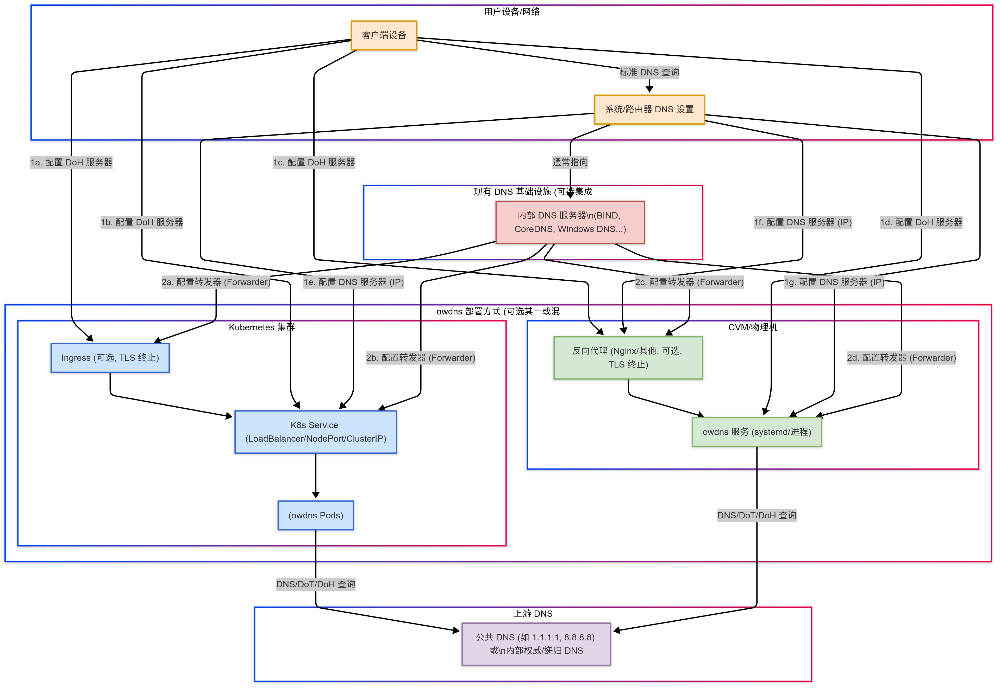

[English](./README.md) | 中文

<div align="center">
    <h1>Oxide WDNS</h1>
    <h4>🚀 一款使用 Rust 编写的高性能 DNS 网关，支持 DNS-over-HTTPS (DoH)。</h4>
    
</div>

[](https://github.com/shengyanli1982/oxide-wdns/actions)

## 简介

### 🤔 为什么需要安全 DNS？

传统的 DNS 查询通常以明文形式在网络上传输（通常通过 UDP 端口 53），这带来了几个显著的问题：

1.  **隐私泄露:** 网络上的中间节点（如 ISP、公共 Wi-Fi 提供商）可以轻易窥探你的 DNS 查询记录，了解你访问了哪些网站。
2.  **DNS 劫持/污染:** 查询可能被恶意篡改，将你导向错误的或恶意的网站（例如钓鱼网站）。
3.  **审查与封锁:** 某些网络环境可能会阻止对特定域名的 DNS 解析，从而限制网络访问。

### 💡 Secure DNS via HTTP (DoH) 如何解决这些问题？

DNS-over-HTTPS (DoH) 是一种将 DNS 查询封装在加密的 HTTPS 连接中的协议 (RFC 8484)。这带来了以下好处：

-   **加密传输:** DNS 查询内容被 HTTPS 加密，有效防止了中间节点的窥探和篡改。
-   **伪装流量:** DoH 查询看起来与普通的 HTTPS 流量无异（都使用 443 端口），使得基于端口或协议特征的 DNS 封锁更加困难。
-   **提升隐私与安全:** 结合 DNSSEC 验证，DoH 可以提供更完整的 DNS 解析安全保障。

### ✨ Oxide WDNS：你的高性能 DoH 网关和客户端

**Oxide WDNS** 是一个使用 Rust 语言构建的高性能、安全可靠的 DoH 解决方案，包含服务端 (`owdns`) 和客户端工具 (`owdns-cli`)。

重要的是，Oxide WDNS 旨在作为传统 DNS 的**无缝扩展**，增强其安全性，而非完全替代；它与现有的 DNS 设施形成**协作关系**。此外，`owdns` 服务端被设计为**无状态服务**，这意味着你可以轻松地进行**水平扩展**以应对高并发负载。

-   **服务端 (`owdns`):** 作为一个 DoH 网关，它接收来自客户端的 DoH 请求，安全地向上游 DNS 服务器查询，并将结果返回给客户端。它非常适合部署在本地网络、边缘节点或云环境中，为你的设备或网络提供统一、安全的 DNS 解析入口。
-   **客户端 (`owdns-cli`):** 一个强大的命令行工具，用于向任何兼容 RFC 8484 的 DoH 服务器发送查询，进行测试、调试和验证。

Oxide WDNS 通过提供加密的 DNS 通道、支持 DNSSEC 验证以及高性能处理能力，直接解决了传统 DNS 面临的隐私泄露、劫持和封锁问题。

### 🎯 适用场景

`owdns` 的设计使其特别适合以下需要高度安全、可靠和高性能 DNS 解析的环境：

-   **大型互联网服务:** 为海量用户和内部系统提供可扩展、安全、高可用的 DNS 解析，通过 DoH 加密保护用户隐私，防止 DNS 缓存投毒和劫持。
-   **工业互联网与智能制造:** 在工业控制系统 (ICS) 和物联网 (IIoT) 环境中，确保设备、传感器和平台之间 DNS 查询的机密性和完整性，防止关键操作指令被篡改或泄露。
-   **中小型云服务提供商:** 将安全的 DoH 解析作为增值服务提供给租户，提升平台安全能力和客户信任度，`owdns` 的高性能和易部署特性使其成为理想选择。
-   **物联网 (IoT) 平台:** 为大量接入的 IoT 设备提供轻量级、安全的 DNS 解析服务，防止设备被 DNS 欺骗攻击劫持，尤其适用于资源受限的边缘计算场景。
-   **医疗保健行业:** 保护访问电子健康记录 (EHR)、远程医疗平台等敏感系统时的 DNS 查询隐私，符合严格的数据安全与合规要求 (如 HIPAA)。
-   **机器人与自动化系统:** 确保机器人集群、自动化产线设备在与控制中心或云平台通信时，能够安全、准确地解析目标服务地址，防止因 DNS 错误导致的操作中断或恶意控制。

### 📐 部署架构图



## 主要特性

**服务端 (`owdns`)**

-   🚀 **高性能:** 基于 Rust 和 Tokio 构建，异步处理，内存效率高。
-   🛡️ **安全可靠:**
    -   完整的 **RFC 8484 (DoH)** 协议实现。
    -   支持 **DNSSEC** 验证，确保响应的真实性和完整性。
    -   内置基于 IP 的**速率限制**和严格的**输入验证**，抵御滥用和攻击。
-   ⚙️ **灵活配置:**
    -   支持 **Wireformat (`application/dns-message`)** 和 **JSON (`application/dns-json`)** 两种 DoH 格式。
    -   支持 **GET** 和 **POST** HTTP 方法。
    -   支持 **HTTP/1.1** 和 **HTTP/2**。
    -   可配置多个**上游 DNS 解析器**，支持 UDP, TCP, DoT (DNS-over-TLS), DoH 多种协议。
    -   灵活的上游选择策略（如轮询、随机）。
-   🔀 **强大的 DNS 分流:** (新特性!)
    -   可定义多个**上游 DNS 服务器组** (`upstream_groups`)，每个组可独立配置解析器、DNSSEC 和超时。
    -   基于灵活的**规则**将 DNS 查询路由到指定分组。
    -   支持的规则类型：**精确**域名匹配、**正则**表达式匹配、**通配符**匹配 (例如 `*.example.com`)、从本地**文件**加载规则、从远程 **URL** 获取规则。
    -   内置特殊 `__blackhole__` 组用于**阻止/丢弃**特定的 DNS 查询 (例如广告拦截)。
    -   可为未匹配规则的查询配置**默认上游组**，或回退到全局上游配置。
    -   支持从远程 URL **自动周期性重载**规则。
-   ⚡ **智能缓存:**
    -   内置高性能 **LRU 缓存** 显著降低延迟，减少上游负载。
    -   支持**负缓存** (Negative Caching)，包括 `__blackhole__` 产生的响应。
    -   可配置缓存大小和 TTL。
-   📊 **可观测性:**
    -   集成 **Prometheus 指标** (`/metrics` 端点)，轻松监控服务状态和性能。
    -   提供 **Kubernetes 健康检查**端点 (`/health`)。
    -   支持**结构化日志** (Tracing)。
-   ☁️ **云原生友好:** 易于容器化和部署。
-   🔌 **优雅关闭:** 支持平滑停止服务，保证处理中的请求完成。

**客户端 (`owdns-cli`)**

-   ✅ **协议兼容:** 支持 RFC 8484 Wireformat 和 Google/Cloudflare JSON 格式。
-   🛡️ **DNSSEC 支持:** 可请求启用 DNSSEC 验证 (设置 DO 位)。
-   🔧 **灵活控制:**
    -   可指定查询**域名**和**记录类型** (A, AAAA, MX, TXT 等)。
    -   可手动选择 **GET** 或 **POST** 方法 (也可自动选择)。
    -   可选择 **HTTP/1.1** 或 **HTTP/2**。
    -   支持发送**原始 DNS 查询载荷** (Hex 编码)。
-   🔎 **响应分析:**
    -   清晰展示解析后的 DNS 响应。
    -   可根据 RCODE、IP 地址等条件**验证响应**。
-   🛠️ **易用性:**
    -   清晰的命令行接口。
    -   详细的输出模式 (`-v, -vv, -vvv`)，便于调试。
    -   支持跳过 TLS 证书验证 (`-k`)，方便测试本地或自签名证书服务器。

## 安装

你可以通过以下方式安装 Oxide WDNS：

1.  **从 GitHub Releases 下载预编译的二进制文件 (推荐):**
    访问项目的 [GitHub Releases](https://github.com/shengyanli1982/oxide-wdns/releases) 页面，下载适用于你操作系统的最新版本。

2.  **从源码编译:**
    确保你已经安装了 [Rust 工具链](https://www.rust-lang.org/tools/install)。

    ```bash
    # 克隆仓库
    git clone https://github.com/shengyanli1982/oxide-wdns.git
    cd oxide-wdns

    # 编译服务端和客户端 (Release 模式，带优化)
    cargo build --release

    # 编译后的二进制文件位于 ./target/release/
    # 服务端: owdns (或 owdns.exe on Windows)
    # 客户端: owdns-cli (或 owdns-cli.exe on Windows)
    ```

## 使用方法

### 服务端 (`owdns`)

1.  **配置文件 (`config.yaml`):**
    服务端通过一个 YAML 文件进行配置。你需要创建一个 `config.yaml` 文件 (或使用 `-c` 指定其他路径)。请参考 `config.default.yaml` 查看完整的结构和默认值。以下是一个包含 DNS 分流功能的关键特性示例：

    ```yaml
    # config.yaml - 包含路由功能的示例

    # HTTP 服务器配置
    http_server:
      listen_addr: "127.0.0.1:3053"
      timeout: 120
      rate_limit:
        enabled: true
        per_ip_rate: 100
        per_ip_concurrent: 10

    # DNS 解析器配置
    dns_resolver:

      # HTTP 客户端配置 (用于 DoH 上游和获取 URL 规则)
      http_client:
        timeout: 120
        pool:
          idle_timeout: 30
          max_idle_connections: 10
        request:
          user_agent: "Oxide-WDNS Client"
          ip_header_names: ["X-Forwarded-For", "X-Real-IP", "CF-Connecting-IP"]

      # 缓存配置
      cache:
        enabled: true
        size: 10000
        ttl:
          min: 60
          max: 86400
          negative: 300 # 负缓存 TTL (NXDOMAIN)，也包括 __blackhole__ 的响应

      # --- 全局/默认上游 DNS 配置 ---
      # 这些设置作为全局默认值，并且在没有路由规则匹配
      # 且未指定 default_upstream_group 时的最终后备选项。
      upstream:
        enable_dnssec: true
        query_timeout: 30 # 秒
        resolvers:
          - address: "1.1.1.1:53"
            protocol: "udp"
          - address: "8.8.8.8:53"
            protocol: "udp"
          # DoT/DoH 上游示例:
          # - address: "cloudflare-dns.com@1.1.1.1:853"
          #   protocol: "dot"
          # - address: "https://cloudflare-dns.com/dns-query"
          #   protocol: "doh"

      # --- DNS 路由配置 ---
      routing:
        # 是否启用 DNS 分流功能
        enabled: true

        # 定义上游 DNS 服务器组
        # 每个组可以有自己的解析器，并覆盖全局设置 (enable_dnssec, query_timeout)。
        upstream_groups:
          - name: "clean_dns" # 示例：一个干净的 DNS 组
            # 继承全局的 enable_dnssec (true) 和 query_timeout (30)
            resolvers:
              - address: "https://dns.quad9.net/dns-query"
                protocol: "doh"
              - address: "9.9.9.9:53"
                protocol: "udp"

          - name: "domestic_dns" # 示例：针对国内域名优化的 DNS 组
            enable_dnssec: false # 覆盖此组的全局设置
            query_timeout: 15   # 覆盖此组的全局设置
            resolvers:
              - address: "https://dns.alidns.com/dns-query"
                protocol: "doh"
              - address: "223.5.5.5:53"
                protocol: "udp"

          - name: "adblock_dns" # 示例：已知提供广告拦截的 DNS 组
            resolvers:
              - address: "https://dns.adguard-dns.com/dns-query"
                protocol: "doh"

        # 定义路由规则 (按顺序处理，第一个匹配的规则生效)
        rules:
          # 规则 1: 使用特殊的 __blackhole__ 组阻止特定的广告域名
          - match:
              type: exact
              values: ["ads.example.com", "analytics.example.org"]
            upstream_group: "__blackhole__" # 特殊组：丢弃查询，返回 NXDOMAIN

          # 规则 2: 将特定的国内域名路由到 domestic_dns 组
          - match:
              type: exact
              values: ["bilibili.com", "qq.com", "taobao.com", "jd.com"]
            upstream_group: "domestic_dns"

          # 规则 3: 将匹配正则表达式的域名路由到 clean_dns 组
          - match:
              type: regex
              values:
                - "^(.*\.)?(google|youtube|gstatic)\.com$"
                - "^(.*\.)?github\.com$"
            upstream_group: "clean_dns"

          # 规则 4: 将匹配通配符的域名路由到 clean_dns 组
          - match:
              type: wildcard
              values: ["*.googleapis.com", "*.ggpht.com"]
            upstream_group: "clean_dns"

          # 规则 5: 从本地文件加载国内域名列表，路由到 domestic_dns
          # 文件格式请参考下方的“域名列表文件格式”部分。
          - match:
              type: file
              path: "/etc/oxide-wdns/china_domains.txt"
            upstream_group: "domestic_dns"

          # 规则 6: 从远程 URL 加载广告域名列表，使用 __blackhole__ 阻止它们
          # 来自 URL 的规则会周期性获取。格式请参考下方说明。
          - match:
              type: url
              url: "https://raw.githubusercontent.com/privacy-protection-tools/anti-AD/master/anti-ad-domains.txt"
            upstream_group: "__blackhole__"

        # 可选：为未匹配任何规则的查询指定默认上游组。
        # 如果设置为有效的组名 (例如 "clean_dns")，则使用该组。
        # 如果为 null 或省略，则使用全局 `dns_resolver.upstream` 配置。
        default_upstream_group: "clean_dns" # 对上面未匹配的查询使用 clean_dns

    ```

    _请根据你的实际需求修改配置。请注意 `routing` 部分提供了强大的 DNS 解析行为控制能力。_

2.  **测试配置文件:**
    在启动服务前，可以使用 `-t` 参数检查配置文件是否有效：

    ```bash
    ./owdns -t -c config.yaml
    ```

3.  **启动服务:**

    **> 方式一：直接运行 (前台)**

    你可以直接在命令行启动 `owdns` 服务。这通常用于测试或临时运行：

    ```bash
    # 使用默认配置文件 config.yaml (需在当前目录)
    ./owdns

    # 指定配置文件路径
    ./owdns -c /path/to/your/config.yaml

    # 启用 Debug 详细日志
    ./owdns -d -c config.yaml
    ```

    _注意：以这种方式启动，服务将在前台运行，关闭终端窗口将终止服务。_

    **> 方式二：使用 systemd (后台服务, 推荐用于 Linux 服务器)**

    如果你希望 `owdns` 在后台作为系统服务运行，并能开机自启，推荐使用 `systemd` 进行管理。我们提供了一个示例服务单元文件 `examples/linux/systemd/owdns.service`。

    **配置步骤:**

    1.  **复制可执行文件:**
        将编译好的 `owdns` 二进制文件复制到系统路径，例如 `/usr/local/bin/`：

        ```bash
        sudo cp ./target/release/owdns /usr/local/bin/
        ```

    2.  **准备配置文件:**
        将你的 `config.yaml` 配置文件放置在 `systemd` 服务文件预期读取的位置。默认的服务文件 (`owdns.service`) 使用 `-c /etc/owdns/config.yaml`，因此你需要：

        ```bash
        # 创建配置目录
        sudo mkdir -p /etc/owdns
        # 复制配置文件
        sudo cp config.yaml /etc/owdns/config.yaml
        ```

        _重要提示：_ `owdns.service` 默认配置了 `DynamicUser=yes`，这意味着 `systemd` 会以一个临时的、低权限的用户（如 `systemd-network`）运行 `owdns` 服务。请确保这个用户**有读取 `/etc/owdns/config.yaml` 文件的权限**。你可以通过 `sudo chown <user>:<group> /etc/owdns/config.yaml` 并设置合适的权限位 (`chmod`) 来调整，或者修改 `owdns.service` 文件中的用户/组设置。

    3.  **安装 systemd 服务文件:**
        将示例服务文件复制到 `systemd` 的系统目录：

        ```bash
        sudo cp examples/linux/systemd/owdns.service /etc/systemd/system/
        ```

        _如果你修改了可执行文件或配置文件的路径，请记得相应地编辑 `/etc/systemd/system/owdns.service` 文件中的 `ExecStart` 行。_

    4.  **重载 systemd 并管理服务:**

        ```bash
        # 让 systemd 重新加载配置
        sudo systemctl daemon-reload

        # 启动 owdns 服务
        sudo systemctl start owdns

        # 设置 owdns 服务开机自启
        sudo systemctl enable owdns

        # 查看服务运行状态
        sudo systemctl status owdns

        # 实时查看服务日志
        sudo journalctl -u owdns -f

        # 停止服务
        # sudo systemctl stop owdns

        # 禁止开机自启
        # sudo systemctl disable owdns
        ```

    **> 方式三：使用 Kubernetes 部署 (推荐用于容器化环境)**

    如果你在 Kubernetes 环境中运行服务，我们提供了示例部署清单，位于 `examples/kubernetes/` 目录下。这些清单通常包括：

    -   `configmap.yaml`: 用于管理 `owdns` 的配置文件 (`config.yaml`)。
    -   `deployment.yaml`: 定义 `owdns` 应用的部署，包括副本数量、容器镜像、端口等。
    -   `service.yaml`: 创建一个 Kubernetes Service，用于暴露 `owdns` 服务，使其可以被集群内部或外部访问。

    **部署步骤:**

    1.  **准备环境:** 确保你有一个运行中的 Kubernetes 集群，并且 `kubectl` 命令行工具已配置好并连接到该集群。

    2.  **自定义配置:**

        -   **编辑 `configmap.yaml`:** 根据你的需求修改 ConfigMap 中的 `config.yaml` 内容，特别是 `http_server.listen_addr` (通常应监听 `0.0.0.0` 或特定 Pod IP 地址，端口按需设置), `dns_resolver.upstream.resolvers` 等。
        -   **编辑 `deployment.yaml` (可选):** 你可能需要修改部署文件中的容器镜像地址 (`spec.template.spec.containers[0].image`)，如果你将镜像推送到了自己的容器仓库。同时可以调整副本数量 (`spec.replicas`)。
        -   **编辑 `service.yaml` (可选):** 根据你的访问需求调整 Service 类型 (如 `ClusterIP`, `NodePort`, `LoadBalancer`) 和端口设置。

    3.  **应用清单:**
        使用 `kubectl` 应用 `examples/kubernetes/` 目录下的所有 YAML 文件：

        ```bash
        kubectl apply -f examples/kubernetes/
        # 或者分别应用
        # kubectl apply -f examples/kubernetes/configmap.yaml
        # kubectl apply -f examples/kubernetes/deployment.yaml
        # kubectl apply -f examples/kubernetes/service.yaml
        ```

    4.  **验证部署:**
        检查 Pod 是否成功运行，Service 是否已创建：

        ```bash
        # 查看 Pod 状态 (应该显示 Running)
        kubectl get pods -l app=owdns # 假设 Deployment/Pod 有 'app=owdns' 标签

        # 查看 Service 信息 (获取访问 IP 和端口)
        kubectl get svc owdns-service # 假设 Service 名称为 'owdns-service'

        # 查看 Pod 日志
        kubectl logs -l app=owdns -f
        ```

    5.  **访问服务:**
        根据你的 Service 配置 (类型和端口)，你可以通过 ClusterIP (内部), NodePort 或 LoadBalancer IP (外部) 来访问部署好的 `owdns` DoH 服务。例如，如果 Service 是 LoadBalancer 类型并暴露了 80 端口，你可以使用 `http://<LoadBalancer-IP>/dns-query` 作为 DoH 端点。

4.  **获取帮助 / 命令行参数:**
    完整的命令行参数可以通过 `-h` 或 `--help` 查看：

    ```bash
    $ ./owdns -h
    High-performance Secure DNS via HTTP (DoH) Gateway

    Key Features:
    - Full RFC 8484 HTTP-based DNS transport compliance
    - Google/Cloudflare JSON format compatibility
    - Advanced DNSSEC validation
    - Multi-protocol upstream support (UDP, TCP, DoT, DoH)
    - Performance-optimized LRU caching
    - Prometheus metrics integration
    - Native Kubernetes health probes
    - Enterprise-grade security with rate limiting and input validation

    Author: shengyanli1982
    Email: shengyanlee36@gmail.com
    GitHub: https://github.com/shengyanli1982

    Usage: owdns.exe [OPTIONS]

    Options:
      -c, --config <CONFIG>  Server configuration file path (YAML format) [default: config.yaml]
      -t, --test             Test configuration file for validity and exit
      -d, --debug            Enable debug level logging for detailed output
      -h, --help             Print help
      -V, --version          Print version
    ```

### 客户端 (`owdns-cli`)

客户端用于向 DoH 服务器发送查询。

1.  **基本查询:**
    向指定的 DoH 服务器 URL 查询域名的 A 记录。

    ```bash
    # 查询 example.com 的 A 记录 (使用 Cloudflare DoH)
    ./owdns-cli https://cloudflare-dns.com/dns-query example.com

    # 查询 example.com 的 A 记录 (使用本地运行的 owdns 服务, 假设监听在 8080 端口)
    # 注意：如果本地服务没有配置 TLS，需要使用 http://
    ./owdns-cli http://localhost:8080/dns-query example.com
    # 如果本地服务配置了 TLS 但使用了自签名证书，可能需要 -k
    ./owdns-cli -k https://localhost:8080/dns-query example.com
    ```

2.  **指定记录类型 (`-r` 或 `--record`):**

    ```bash
    # 查询 google.com 的 MX 记录
    ./owdns-cli https://dns.google/dns-query google.com -r MX
    ```

3.  **选择 DoH 格式 (`--format`):**

    ```bash
    # 使用 JSON 格式查询
    ./owdns-cli https://cloudflare-dns.com/dns-query example.com --format json
    ```

4.  **启用 DNSSEC (`--dnssec`):**
    请求服务器进行 DNSSEC 验证（服务器需要支持）。

    ```bash
    ./owdns-cli https://cloudflare-dns.com/dns-query sigfail.verteiltesysteme.net --dnssec
    ```

5.  **强制使用 POST 方法 (`-X POST`):**

    ```bash
    ./owdns-cli https://cloudflare-dns.com/dns-query example.com -X POST
    ```

6.  **详细输出 (`-v`, `-vv`, `-vvv`):**
    增加 `-v` 的数量以获取更详细的调试信息（包括 HTTP 头和请求/响应细节）。

    ```bash
    ./owdns-cli https://cloudflare-dns.com/dns-query example.com -v
    ```

7.  **验证响应 (`--validate`):**
    检查响应是否满足特定条件。

    ```bash
    # 验证响应 RCODE 是否为 NOERROR，并且包含 IP 1.1.1.1
    ./owdns-cli https://cloudflare-dns.com/dns-query one.one.one.one --validate 'rcode=NOERROR,has-ip=1.1.1.1'
    ```

8.  **获取帮助 / 命令行参数:**
    完整的命令行参数可以通过 `-h` 或 `--help` 查看：

    ```bash
    $ ./owdns-cli -h
    A command-line client for Secure DNS via HTTP (DoH).

    Features:
    - RFC 8484 wireformat and Google/Cloudflare JSON support
    - DNSSEC validation requests
    - GET/POST method selection (automatic or manual)
    - HTTP/1.1 and HTTP/2 support
    - Response analysis and validation

    Author: shengyanli1982
    Email: shengyanlee36@gmail.com
    GitHub: https://github.com/shengyanli1982

    Usage: owdns-cli.exe [OPTIONS] <SERVER_URL> <DOMAIN>

    Arguments:
      <SERVER_URL>  Full URL of the DoH server endpoint (e.g., https://cloudflare-dns.com/dns-query)
      <DOMAIN>      Domain name to query via the DoH server (e.g., example.com)

    Options:
      -r, --record <RECORD_TYPE>  DNS record type to query (e.g., A, AAAA, MX, TXT) [default: A]
          --format <FORMAT>       DoH request format: 'wire' (application/dns-message) or 'json' (application/dns-json) [default: wire] [possible values: wire, json]
      -X, --method <METHOD>       Force the HTTP method (GET or POST). Auto-selected if unspecified [possible values: get, post]
          --http <HTTP_VERSION>   Preferred HTTP version for communication (1.1 or 2) [possible values: http1, http2]
          --dnssec                Enable DNSSEC validation by setting the DNSSEC OK (DO) bit
          --payload <PAYLOAD>     Send a raw, hex-encoded DNS query payload (overrides domain/type)
          --validate <VALIDATE>   Validate the response against comma-separated conditions (e.g., 'rcode=NOERROR', 'has-ip=1.2.3.4')
      -k, --insecure              Skip TLS certificate verification (use with caution)
      -v, --verbose...            Increase output verbosity (-v, -vv, -vvv)
          --no-color              Disable colored output in the terminal
      -h, --help                  Print help
      -V, --version               Print version
    ```

### 示例客户端脚本

你可以在 `examples/client/` 目录下找到使用不同语言（如 Python, Shell, Go 等）调用 DoH API 的示例脚本。

## 域名列表文件格式

当你在 `config.yaml` 的 `routing.rules` 部分使用 `file` 或 `url` 类型的规则时，Oxide WDNS 期望引用的文件（本地文件或从 URL 获取的文件）遵循以下特定格式：

-   **编码:** 文件必须是 UTF-8 编码。
-   **结构:** 每行一个条目。
-   **注释:** 以 `#` 开头的行被视为注释并忽略。
-   **空行:** 空行将被忽略。
-   **默认匹配类型:** 默认情况下，每个非注释、非空行被视为一个需要**精确**匹配的域名。
-   **其他匹配类型前缀:**
    -   `regex:`: 如果一行以 `regex:` 开头，则该行剩余的部分被视为一个用于匹配域名的**正则表达式**模式。
    -   `wildcard:`: 如果一行以 `wildcard:` 开头，则该行剩余的部分被视为一个**通配符**模式（例如 `*.example.com`，它能匹配 `www.example.com` 和 `example.com`）。

**示例文件 (`/etc/oxide-wdns/example_list.txt`):**

```
# === 示例域名列表 ===
# 这是一行注释

# 精确匹配 (默认)
google.com
github.com

# 通配符匹配
wildcard:*.wikipedia.org
wildcard:*.google.ac

# 正则表达式匹配
regex:^.*\.cn$
regex:^ads?\..*\.com$

# 另一行注释

```

这种格式允许你在单个规则源文件或 URL 中组合使用不同的匹配策略。对于 `url` 类型的规则，Oxide WDNS 将根据这种格式周期性地获取并重新解析其内容。

## 贡献

欢迎提交 Issues 和 Pull Requests！请确保遵循项目的代码规范

## 许可证

本项目采用 [MIT](./LICENSE) 许可证。
